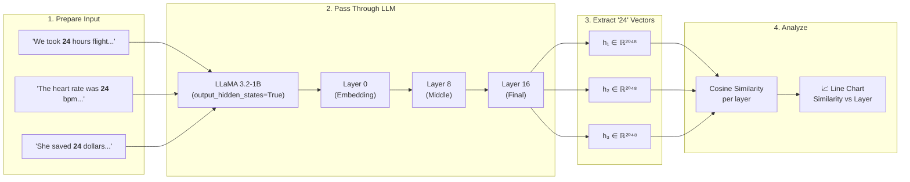

# Contextual Numerical Representation Analysis

> **TL;DR:** Does the number "24" look the same inside an LLM when it appears in "24-hour flight" vs. "heart rate of 24 bpm"?

[🇹🇼 中文版 README](README.md)

---

## Quick Start — Understand This Research in 30 Seconds

```
🔬 Core Question
   When an LLM reads a number, does its hidden state reflect the context?

💡 Method
   Same number in different context sentences → extract hidden states → compute cosine similarity

📊 Findings
   ✅ Early layers (embedding): same token → nearly identical representations
   ✅ Mid-to-late layers: model starts "understanding context", similarity drops significantly
   ✅ In medical scenarios, dangerous vs. normal values show the largest divergence pattern
```

**Want to run it? Three steps:**

```bash
pip install -r requirements.txt     # 1. Install dependencies
huggingface-cli login               # 2. Log in to HuggingFace (LLaMA access required)
python numerical_context_analysis_v1.py  # 3. Run experiment, plots generated automatically
```

---

## Method Overview



**Key Intuition:** If the model only sees "the token 24", hidden states across different sentences should be identical. But if the model encodes context, cosine similarity will decrease with depth.

---

## Experimental Results

### v1 — Cross-Context + Cross-Magnitude

| Experiment | Question |
|------------|----------|
| **Exp A** | Same "24" in flight / learning / apples / heart rate / money contexts — how different are the representations? |
| **Exp B** | Same sentence template with 2.4 / 24 / 240 — how much do representations differ? |

<p align="center">
  
</p>

> **Observations:**
> - **Exp A:** "24 bpm (medical)" diverges the most, dropping from ~1.0 at Layer 0 to ~0.53 at Layer 16, clearly separating from other contexts. Similar contexts (flight vs. learning) maintain ~0.89 high similarity, showing the model does distinguish contexts in deeper layers — and the greater the semantic gap, the larger the separation.
> - **Exp B:** Different numbers (2.4 / 24 / 240) start very dissimilar at Layer 0 (~0.4–0.5) but converge to ~0.85–0.89 in deeper layers, suggesting the model increasingly encodes "sentence semantics" rather than "numerical face value" in later layers.
> - **Heatmap:** The pairwise similarity at the final layer confirms "24 bpm" is the outlier (only 0.53–0.64 with other contexts), while all other context pairs show similarity > 0.82.

---

### v2 — Medical Value Severity Discrimination

| Context | Test Values | Normal Baseline |
|---------|------------|----------------|
| Blood Pressure (mmHg) | 40 / 79 / **120** / 180 | 120 |
| Body Temperature (°C) | 25 / 35 / **37** / 41 | 37 |
| Heart Rate (bpm) | 30 / 55 / **75** / 180 | 75 |
| Blood Glucose (mg/dL) | 40 / **90** / 180 / 400 | 90 |
| Respiratory Rate (breaths/min) | 4 / **16** / 25 / 40 | 16 |

<p align="center">
  
</p>

> **Observations:**
> - **Opposite trend from v1:** Different values show larger divergence in early layers (cosine similarity as low as 0.3–0.5), but gradually converge to 0.9–1.0 in deeper layers. This indicates the model encodes "medical context" more than distinguishing the numbers themselves in later layers.
> - **Final layer barely distinguishes severity:** The summary bar chart shows that Danger Low / Mild / Normal / High all cluster within 0.91–1.00 similarity at Layer 16 across all contexts — minimal separation.
> - **U-shape test does not hold:** In the bottom-right scatter plot, extreme danger values do not show the expected U-shaped dip; all points cluster at roughly the same level.
> - **Conclusion:** A 1B-parameter model, when given "same medical context, different numerical values", produces nearly identical deep-layer representations and cannot effectively distinguish clinical severity. Larger models, richer context, or fine-tuning may be needed to encode danger levels in the representation.

---

## File Descriptions

| File | Description |
|------|-------------|
| `numerical_context_analysis_v1.py` | Base version: Exp A (cross-context) + Exp B (cross-magnitude) |
| `numerical_context_analysis_v2.py` | Advanced version: Exp C (medical value severity discrimination) |
| `results/` | Experiment output plots |
| `requirements.txt` | Dependency list |

---

## Installation

```bash
pip install -r requirements.txt
```

---

## HuggingFace Login

This project uses Meta's LLaMA model. You need to log in to HuggingFace first (**API key is not included in this repository**):

```bash
huggingface-cli login
```

Credentials are stored locally at `~/.cache/huggingface/` and read automatically at runtime.

---

## Usage

```bash
# v1: Cross-context experiments (Exp A + B)
python numerical_context_analysis_v1.py

# v2: Medical value experiments (Exp C)
python numerical_context_analysis_v2.py
```
