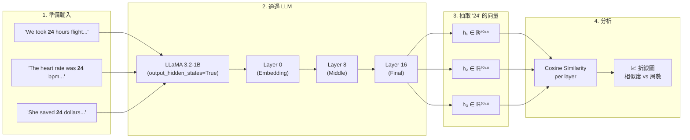
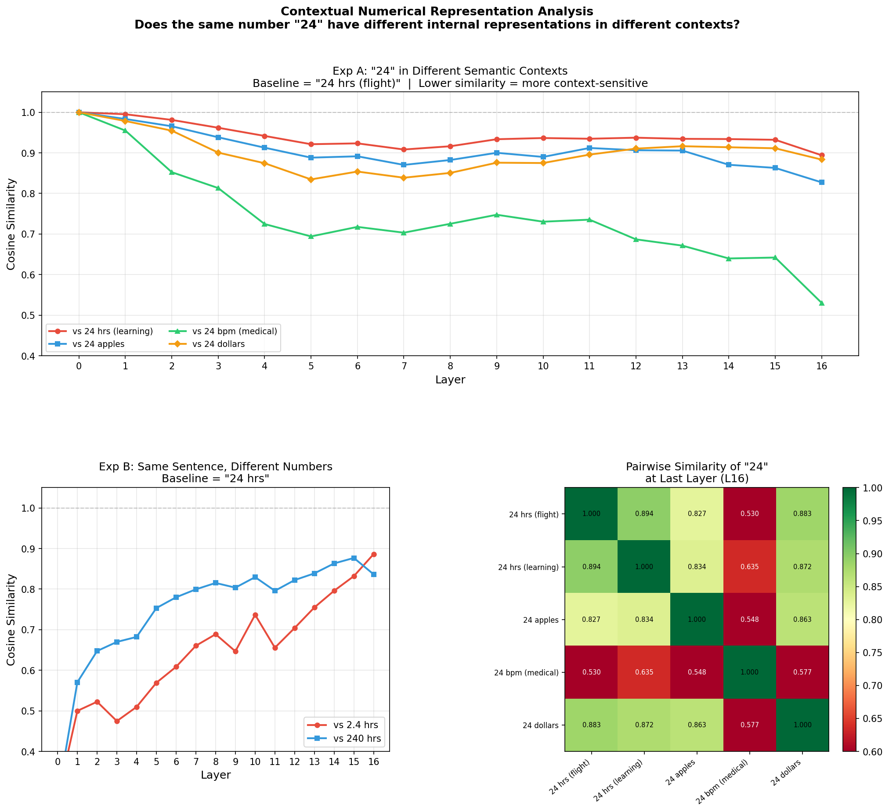
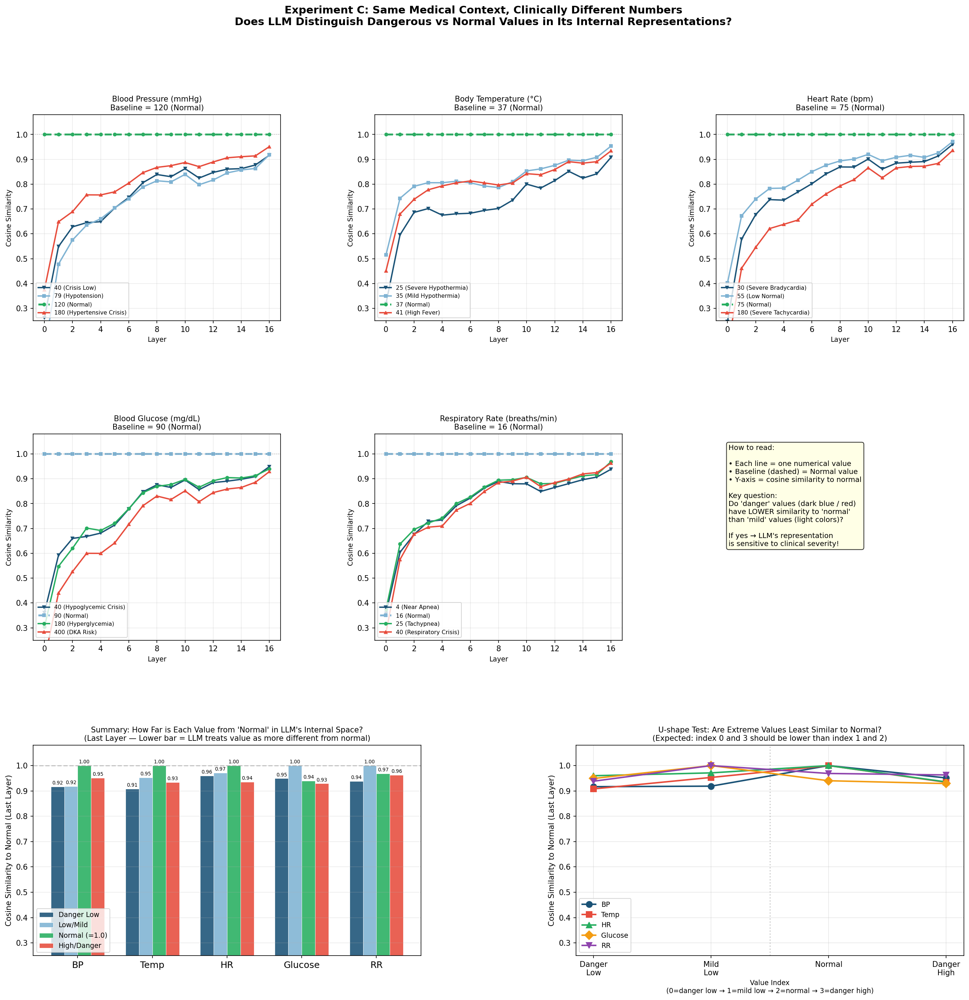

# 數值語境表示分析 / Contextual Numerical Representation Analysis

> **一句話摘要：** 同一個數字 "24"，放在「飛行時數」和「心跳」的句子裡，LLM 內部看到的是同一個東西嗎？

---

## Quick Start — 30 秒看懂這個研究

```
🔬 核心問題
   LLM 讀到一個數字時，它的 hidden state 會反映「語境」嗎？

💡 方法
   把同一個數字塞進不同語境的句子 → 抽出 hidden states → 算 cosine similarity

📊 發現
   ✅ 早期層（embedding）：數字長得一樣，表示幾乎相同
   ✅ 中後層：模型開始「理解語境」，相似度顯著下降
   ✅ 醫療場景中，危險數值 vs 正常數值的表示差異最大
```

**想跑起來？三步搞定：**

```bash
pip install -r requirements.txt     # 1. 裝套件
huggingface-cli login               # 2. 登入 HuggingFace（需 LLaMA 存取權）
python numerical_context_analysis_v1.py  # 3. 跑實驗，自動出圖
```

---

## 方法示意圖



**核心邏輯：** 如果模型只看到「24 這個 token」，不同句子的 hidden state 應該一樣。但如果模型把語境編碼進去了，cosine similarity 會隨層數下降。

---

## 實驗結果

### v1 — 跨語境 + 跨數量級

| 實驗 | 問的問題 |
|------|---------|
| **Exp A** | 同一個 "24"，在飛行／學習／蘋果／心跳／金錢語境下，表示有多不同？ |
| **Exp B** | 同一個句型，換成 2.4 / 24 / 240，表示差多少？ |

<p align="center">
  
</p>

> **觀察：**
> - **Exp A：** 「24 bpm（醫療）」偏離最劇烈，從 Layer 0 的 ~1.0 一路降到 Layer 16 的 ~0.53，與其他語境拉開明顯差距。相近語境（flight vs learning）則維持 ~0.89 的高相似度，顯示模型在深層確實能區分語境——且語義差異越大，分離越明顯。
> - **Exp B：** 不同數字（2.4 / 24 / 240）在 Layer 0 極度不同（~0.4–0.5），但隨層數加深反而收斂到 ~0.85–0.89，說明模型在後層更傾向編碼「句子語義」而非「數字面值」。
> - **Heatmap：** 最後一層的 pairwise similarity 確認「24 bpm」是離群者（與各語境僅 0.53–0.64），其餘語境兩兩相似度皆 > 0.82。

---

### v2 — 醫療數值危險程度辨識

| 語境 | 測試數值 | 正常基準 |
|------|---------|---------|
| 血壓 (mmHg) | 40 / 79 / **120** / 180 | 120 |
| 體溫 (°C) | 25 / 35 / **37** / 41 | 37 |
| 心跳 (bpm) | 30 / 55 / **75** / 180 | 75 |
| 血糖 (mg/dL) | 40 / **90** / 180 / 400 | 90 |
| 呼吸頻率 (次/分) | 4 / **16** / 25 / 40 | 16 |

<p align="center">
  
</p>

> **觀察：**
> - **趨勢與 v1 相反：** 不同數值在早期層差異反而較大（cosine similarity 低至 0.3–0.5），隨層數加深逐漸收斂到 0.9–1.0。這代表模型後期更多在編碼「醫療語境」而非區分數字本身。
> - **最後一層幾乎無法區分危險程度：** Summary bar chart 顯示，所有語境的 Danger Low / Mild / Normal / High 在 Layer 16 的相似度都落在 0.91–1.00 之間，差距極小。
> - **U-shape test 不成立：** 右下角散點圖中，極端危險值並未出現預期的 U 型低谷，各點幾乎擠在同一水平。
> - **結論：** 1B 參數模型在「同一醫療語境、不同數值」的設定下，深層表示幾乎趨同，無法有效區分臨床嚴重程度。可能需要更大模型、更豐富的上下文、或 fine-tuning 才能讓表示反映危險等級。

---

## 檔案說明

| 檔案 | 說明 |
|------|------|
| `numerical_context_analysis_v1.py` | 基礎版：實驗 A（跨語境）+ 實驗 B（跨數量級） |
| `numerical_context_analysis_v2.py` | 進階版：實驗 C（醫療數值危險程度辨識） |
| `results/` | 實驗輸出圖 |
| `requirements.txt` | 環境依賴清單 |

---

## 環境安裝

```bash
pip install -r requirements.txt
```

---

## HuggingFace 登入

程式使用 Meta LLaMA 模型，需要先登入 HuggingFace（**金鑰不包含在此資料夾中**，請自行設定）：

```bash
huggingface-cli login
```

登入後憑證會存在本機 `~/.cache/huggingface/`，程式執行時自動讀取。

---

## 執行方式

```bash
# v1：基礎語境實驗（Exp A + B）
python numerical_context_analysis_v1.py

# v2：醫療數值語境實驗（Exp C）
python numerical_context_analysis_v2.py
```
