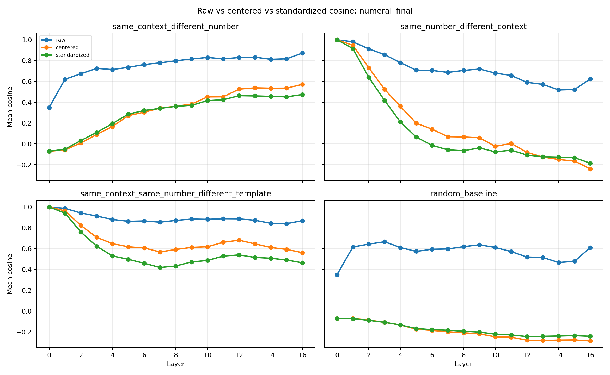

# Numerical Representations in Context

**Geometry, linear decodability, and decision behavior in Llama 3.2**

[](LICENSE)
[](https://www.python.org/)
[](#project-status)

**Tzu-Ting (Tina) Chu** · Updated August 2026

This repository investigates how language models represent numerical values in context. It combines layer-wise hidden-state geometry, behavioral evaluation, probing controls, and reproducible analysis scripts to separate three questions:

1. **Geometry:** how do context and numerical value organize hidden states?
2. **Availability:** can numerical magnitude be decoded from a specific layer and token position?
3. **Causal use:** does the model actually use that information to produce its answer?

The third question remains open. This repository contains exploratory experiments and a completed geometry/probe validation; it does **not** yet establish a causal mechanism or clinical reliability.

## Why this project

Language models can produce or accept implausible measurements while responding fluently. An early version of this project described this as a *representation-behavior gap* and interpreted high within-context cosine similarity as evidence that numerical distinctions disappear in deep layers.

Subsequent controls changed that interpretation. After accounting for anisotropy, matched random pairs, token position, held-out generalization, and shuffled-label controls, the more defensible result is:

> Context-related clustering and decodable numerical magnitude can coexist. Geometry alone does not show that magnitude has disappeared, and probe performance alone does not show that the model uses the decoded information.

The original gap framing is therefore retained only as part of the project's research history. The current framework treats **geometry**, **availability**, and **causal use** as distinct levels of evidence.

## Current evidence

All claims below are exploratory and limited to the tested Llama 3.2 checkpoints, prompts, values, layers, and token positions.

### 1. Same-context clustering is the clearest geometric effect

The completed validation uses `meta-llama/Llama-3.2-1B` (base), 225 stimuli, 17 hidden states, three contexts, five templates per context, and 15 values from 40 to 180.

At the final numeral position in Layer 16:

| Cosine condition | Same context, different number | Same number, different context | Cross-context random baseline |
|---|---:|---:|---:|
| Raw | 0.872 | 0.624 | 0.610 |
| Mean-centered | 0.572 | -0.241 | -0.288 |
| Per-dimension standardized | 0.474 | -0.186 | -0.243 |

The raw same-number/cross-context value looks substantial in isolation, but it is only 0.014 above its random baseline. The large effect that survives correction is the clustering of different numbers within the same context.



### 2. Numerical magnitude remains linearly decodable at the numeral position

A ridge probe trained on numeral-final activations continues to predict magnitude in late layers:

| Layer 16 split | True-label R² | Shuffled-label R² |
|---|---:|---:|
| Held-out templates | 0.852 | -6.399 |
| Held-out interpolation values | 0.920 | -0.573 |

This shows that high within-context cosine does not imply absence of numerical information. It does not show that the language model causally uses that information.

### 3. Generalization depends on the measurement position

At prompt-final, the value-interpolation probe remains strong at Layer 16 (`R² = 0.864`), but the held-out-template probe fails (`R² = -3.412`). This suggests that a linear map learned at prompt-final does not transfer to unseen wording in the present stimulus set.

The numeral-final result is more robust across the two recorded splits, although the Layer 0 template result is partly explained by repeated numeral-token identity. The [expanded validation report](results/exp_geometry_probe_validation/20260715_073705_meta-llama_Llama-3.2-1B_full/geometry_probe_validation_expanded_report.md) documents the exact folds, preprocessing audit, cluster-aware intervals, and evidence boundary.

### 4. Behavior is sensitive to model, prompt, and answer format

The behavioral study contains 1,152 inferences across two Instruct checkpoints, three output formats, four prompting strategies, eight contexts, and six severity levels.

- Best observed accuracy: **45.8%** (`3B / category / role-prompting`).
- Strongest observed ordinal association: **Spearman ρ = 0.9085** (`3B / category / zero-shot`).
- Numeric-format conditions often have weak risk-sensitive performance and, for some 1B conditions, low parse rates or refusals.

These metrics describe different aspects of behavior and are not combined into a single “gap” score.

## What is not established

The current results do **not** establish that:

- numerical information disappears from deep representations;
- medical context uniquely destroys numerical identity;
- a linear probe reveals information used by the original model;
- task-conditioned construction has been demonstrated;
- the exploratory 1B/3B patterns generalize to other model families or scales;
- synthetic clinical prompts provide evidence of deployment safety or clinical utility.

## Research progression

| Stage | Script | Question | Main lesson |
|---|---|---|---|
| Exp A/B | [`numerical_context_analysis_v1.py`](numerical_context_analysis_v1.py) | How do context and order of magnitude affect the token for `24`? | Motivated context sensitivity, but exposed template, tokenization, and position confounds. |
| Exp C | [`numerical_context_analysis_v2.py`](numerical_context_analysis_v2.py), [`v3.py`](numerical_context_analysis_v3.py) | Do values with different clinical severity separate within one context? | High late-layer cosine motivated a geometry audit; 1B and 3B were similar in broad pattern but not identical. |
| Exp D | [`numerical_context_analysis_v4.py`](numerical_context_analysis_v4.py) | Does PCA organize points by context or severity? | The first two PCs primarily reflected context; low-dimensional visualization cannot establish information absence. |
| Exp E | [`numerical_context_analysis_v5.py`](numerical_context_analysis_v5.py) | How do model size, prompting, and output format affect behavior? | Behavior varies substantially with evaluation design; accuracy, rank correlation, Risk F1, and parse rate must remain separate. |
| Specificity/wording controls | [`clinical_specificity_experiment.py`](clinical_specificity_experiment.py), [`hr_wording_flight_baseline_experiment.py`](hr_wording_flight_baseline_experiment.py) | Does clinical wording affect displacement? | Semantic specificity remains a candidate explanation, but the early samples were small. |
| Position controls | [`keyword_position_experiment.py`](keyword_position_experiment.py), [`token_position_control_experiment.py`](token_position_control_experiment.py) | Is a keyword effect separable from token position? | Absolute token position is a strong confound; approximate matching is not a complete control. |
| Geometry/probe validation | [`geometry_probe_validation.py`](geometry_probe_validation.py) | Does the context-dominant ordering survive correction, and is magnitude still decodable? | Same-context clustering survives correction; magnitude remains available at numeral-final; causal use is unresolved. |

## Validation design

The geometry/probe validation was designed to audit the strongest interpretation of the earlier experiments.

- **Model:** `meta-llama/Llama-3.2-1B` base checkpoint, with resolved revision saved in `config.json`.
- **Stimuli:** 3 contexts × 5 templates × 15 values = 225 prompts.
- **Positions:** final token of the numeral and final token of the prompt.
- **Geometry:** raw, global mean-centered, and per-dimension standardized cosine.
- **Pair categories:** same-context/different-number, same-number/different-context, same-context/same-number/different-template, and cross-context/different-number baseline.
- **Uncertainty:** crossed template/value cluster bootstrap for dyadic pair dependence.
- **Probing:** ridge regression with held-out-template and held-out-interpolation-value splits.
- **Control:** shuffled value labels, retained as negative R² when performance is worse than the mean baseline.

The main machine-readable outputs are in [`results/exp_geometry_probe_validation/`](results/exp_geometry_probe_validation/). The large `pairwise_measurements.csv` from the full run is intentionally excluded from Git; summary tables, reports, figures, stimuli, and configuration metadata are tracked.

## Reproduce the validation

### Requirements

- Python 3.9 or later
- Access to the gated Meta Llama checkpoint on Hugging Face
- A CUDA-capable GPU is recommended for the full model run; the smoke test runs on CPU

Install dependencies and authenticate:

```bash
python -m pip install -r requirements.txt
huggingface-cli login
```

Check that the full checkpoint can be resolved without running the experiment:

```bash
python geometry_probe_validation.py --validate-load-only
```

Run a CPU-friendly pipeline test with a tiny random model:

```bash
python geometry_probe_validation.py --smoke-test --device cpu
```

Run the full validation:

```bash
python geometry_probe_validation.py \
  --model meta-llama/Llama-3.2-1B \
  --batch-size 4
```

Outputs are saved to a timestamped directory under `results/exp_geometry_probe_validation/`. A completed output directory contains:

```text
config.json
stimuli.csv
pairwise_measurements.csv
pairwise_summary.csv
pairwise_regression.csv
probe_results.csv
geometry_probe_validation_report.md
```

Regenerate the expanded report and cluster-aware summaries from a completed run without loading the model again:

```bash
python regenerate_geometry_probe_report.py \
  results/exp_geometry_probe_validation/<run_directory>
```

The historical experiment scripts are retained with their generated outputs for auditability. They use fixed model identifiers, predate the validation CLI, and have not all been revalidated against the current dependency stack. Review them before reuse; the geometry/probe validation is the maintained reproducible workflow in this repository.

## Repository map

```text
numerical_context_analysis/
├── numerical_context_analysis_v1.py       # Exp A/B: context and magnitude
├── numerical_context_analysis_v2.py       # Exp C: 1B medical severity geometry
├── numerical_context_analysis_v3.py       # Exp C: 3B replication
├── numerical_context_analysis_v4.py       # Exp D: PCA visualization
├── numerical_context_analysis_v5.py       # Exp E: behavioral evaluation
├── v5_generate_analysis.py                # Exp E summaries and figures
├── geometry_probe_validation.py           # Controlled geometry/probe validation
├── regenerate_geometry_probe_report.py    # Report regeneration from saved CSVs
├── clinical_specificity_experiment.py     # Clinical-specificity control
├── hr_wording_flight_baseline_experiment.py
├── keyword_position_experiment.py         # Keyword/position control
├── token_position_control_experiment.py   # Approximate position matching
├── mechanistic_causal_skeleton.py         # Development scaffold, not final evidence
├── results/                               # Tracked figures, summaries, and reports
├── requirements.txt
├── LICENSE
└── README.md
```

## Project status

**Current stage:** exploratory geometry/probe validation is complete; confirmatory causal testing is not.

The next-stage design treats the following as competing hypotheses:

- **Select:** decision-relevant information is already present and later selected or reweighted.
- **Construct:** a task-relevant decision structure emerges only after task-conditioned integration.
- **Format-driven:** the apparent structure is induced by decision format rather than value relevance.
- **No causal correspondence:** the observed geometry is epiphenomenal to the answer.

Planned tests combine held-out probing and activation patching at the same `(layer, token position)` locus. The repository's [`mechanistic_causal_skeleton.py`](mechanistic_causal_skeleton.py) is only a development scaffold and should not be treated as a completed experiment.

## Methodological references

- Wallace et al. (2019), [*Do NLP Models Know Numbers? Probing Numeracy in Embeddings*](https://aclanthology.org/D19-1534/)
- Hewitt & Liang (2019), [*Designing and Interpreting Probes with Control Tasks*](https://aclanthology.org/D19-1275/)
- Timkey & van Schijndel (2021), [*All Bark and No Bite: Rogue Dimensions in Transformer Language Models Obscure Representational Quality*](https://aclanthology.org/2021.emnlp-main.372/)
- Belinkov (2022), [*Probing Classifiers: Promises, Shortcomings, and Advances*](https://direct.mit.edu/coli/article/48/1/207/107571/)
- Zhu et al. (2025), [*Language Models Encode the Value of Numbers Linearly*](https://aclanthology.org/2025.coling-main.47/)
- Yuchi et al. (2026), [*LLMs Know More About Numbers than They Can Say*](https://aclanthology.org/2026.eacl-short.47/)

## Scope and responsible interpretation

Clinical measurements are used as controlled semantic stimuli because their thresholds make value relevance easy to manipulate. The experiments are synthetic and are not evaluations of medical devices, clinical workflows, or patient outcomes. Nothing in this repository should be interpreted as medical advice or evidence that a tested model is suitable for clinical deployment.

## Citation

If you use this repository, please cite:

```text
Chu, T.-T. (2026). Numerical Representations in Context: Geometry,
Linear Decodability, and Decision Behavior in Llama 3.2.
GitHub repository: https://github.com/tinginde/numerical_context_analysis
```

## License

Released under the [MIT License](LICENSE).
