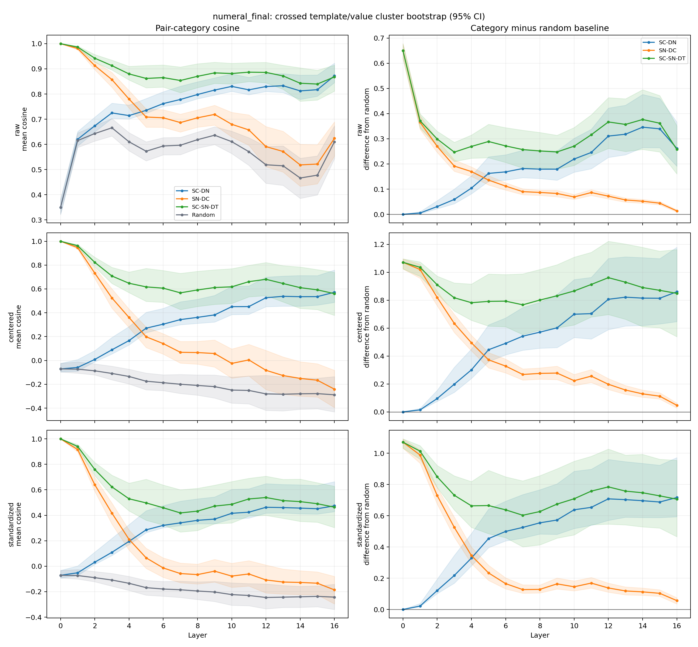
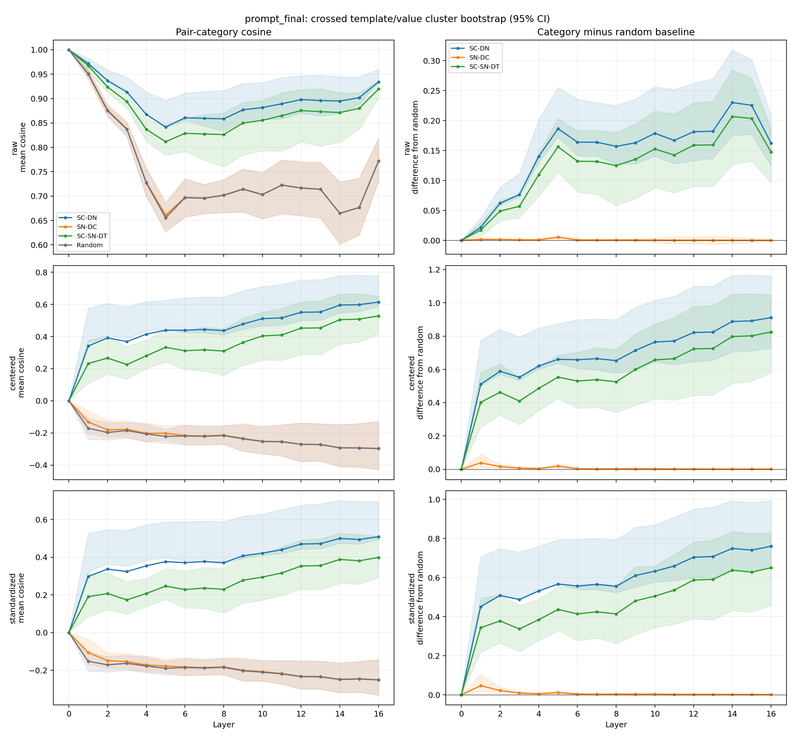

# Expanded Geometry and Probe Validation Report

> Regenerated only from the completed Llama-3.2-1B CSV outputs. No model was loaded, no activations were re-extracted, and no 3B or Instruct experiment was started.

## Original research question

Does the original context-dominant ordering survive controls for anisotropy: are representations of different numbers in the same semantic context more similar than representations of the same number across semantic contexts? Separately, does numeric magnitude remain linearly decodable even when same-context cosine is high?

## Main finding

The original context-dominant geometric ordering survives both global mean-centering and per-dimension standardization. At the numeral position, numerical magnitude also remains linearly decodable, including in late layers. Therefore, high same-context cosine does not demonstrate disappearance of numeric information.

## Position comparability

**Numeral-final is the extraction position comparable to the original experiments. Prompt-final is an added control.**

## Scope and run identity

- Model: `meta-llama/Llama-3.2-1B` at revision `4e20de362430cd3b72f300e6b0f18e50e7166e08` (1,235,814,400 parameters).
- Hidden-state layers: 0–16 (17 states, with layer 0 the embedding output).
- Stimuli: 225 = 3 contexts × 5 templates × 15 values (40–180 by 10).
- Positions: final token of the numeral and final token of the prompt.
- Cosines: raw, global mean-centered, and global per-dimension standardized.
- This is descriptive geometry and linear decodability, not causal evidence.

## Uncertainty and dependence

Pairwise uncertainty uses 500 crossed cluster-bootstrap replicates (seed 13). Each replicate independently resamples the 15 context-specific template clusters and the 15 numeric-value clusters, then weights a dyad by the multiplicities of both endpoints. Category-versus-random differences use the same replicate for both means. This preserves major template/value dependence and replaces the original independent-row bootstrap. `n` remains the number of pair rows, not an independent-sample count.

Probe intervals are the existing fold-level bootstrap intervals: five held-out-template folds or two held-out-value folds. The two-fold intervals are intrinsically unstable and should not be read as precise sampling uncertainty.

Machine-readable expanded results: [pairwise cluster summary](pairwise_cluster_summary.csv), [category minus random](pairwise_relative_to_random.csv), and [cluster-aware regressions](pairwise_regression_cluster_ci.csv).

## Compact geometry views

The middle layer is 8. The final quartile is defined as the last ceil(17/4) hidden states: layers 12–16. The compact selection is 0, 8, 12, 13, 14, 15, 16; the final layer is included in the final quartile and shown explicitly as the endpoint.

### Layer 0, middle, final quartile, and final layer

Cells are mean cosine [cluster-bootstrap 95% CI]; n.

**numeral_final — raw**

| Layer | SC-DN | SN-DC | SC-SN-DT | Random |
|---|---|---|---|---|
| 0 | 0.350 [0.322, 0.381]; n=7875 | 1.000 [1.000, 1.000]; n=1125 | 1.000 [1.000, 1.000]; n=450 | 0.350 [0.322, 0.381]; n=15750 |
| 8 | 0.798 [0.781, 0.848]; n=7875 | 0.705 [0.668, 0.737]; n=1125 | 0.870 [0.825, 0.920]; n=450 | 0.619 [0.585, 0.649]; n=15750 |
| 12 | 0.830 [0.810, 0.881]; n=7875 | 0.591 [0.512, 0.671]; n=1125 | 0.886 [0.844, 0.926]; n=450 | 0.519 [0.445, 0.592]; n=15750 |
| 13 | 0.833 [0.806, 0.881]; n=7875 | 0.572 [0.490, 0.652]; n=1125 | 0.872 [0.819, 0.914]; n=450 | 0.515 [0.437, 0.594]; n=15750 |
| 14 | 0.812 [0.779, 0.875]; n=7875 | 0.518 [0.434, 0.600]; n=1125 | 0.843 [0.771, 0.904]; n=450 | 0.466 [0.386, 0.545]; n=15750 |
| 15 | 0.817 [0.791, 0.876]; n=7875 | 0.522 [0.443, 0.599]; n=1125 | 0.840 [0.776, 0.894]; n=450 | 0.478 [0.399, 0.554]; n=15750 |
| 16 | 0.872 [0.845, 0.923]; n=7875 | 0.624 [0.554, 0.689]; n=1125 | 0.868 [0.811, 0.915]; n=450 | 0.610 [0.543, 0.674]; n=15750 |

**numeral_final — centered**

| Layer | SC-DN | SN-DC | SC-SN-DT | Random |
|---|---|---|---|---|
| 0 | -0.071 [-0.096, -0.024]; n=7875 | 1.000 [1.000, 1.000]; n=1125 | 1.000 [1.000, 1.000]; n=450 | -0.071 [-0.096, -0.024]; n=15750 |
| 8 | 0.361 [0.311, 0.513]; n=7875 | 0.066 [-0.031, 0.160]; n=1125 | 0.591 [0.453, 0.748]; n=450 | -0.209 [-0.291, -0.121]; n=15750 |
| 12 | 0.526 [0.451, 0.699]; n=7875 | -0.083 [-0.245, 0.084]; n=1125 | 0.681 [0.544, 0.822]; n=450 | -0.280 [-0.419, -0.125]; n=15750 |
| 13 | 0.538 [0.456, 0.708]; n=7875 | -0.127 [-0.284, 0.030]; n=1125 | 0.646 [0.491, 0.795]; n=450 | -0.283 [-0.423, -0.137]; n=15750 |
| 14 | 0.535 [0.455, 0.713]; n=7875 | -0.151 [-0.300, -0.011]; n=1125 | 0.611 [0.437, 0.784]; n=450 | -0.280 [-0.409, -0.148]; n=15750 |
| 15 | 0.536 [0.465, 0.712]; n=7875 | -0.166 [-0.306, -0.028]; n=1125 | 0.592 [0.427, 0.762]; n=450 | -0.278 [-0.405, -0.149]; n=15750 |
| 16 | 0.572 [0.487, 0.759]; n=7875 | -0.241 [-0.395, -0.082]; n=1125 | 0.561 [0.378, 0.740]; n=450 | -0.288 [-0.431, -0.135]; n=15750 |

**numeral_final — standardized**

| Layer | SC-DN | SN-DC | SC-SN-DT | Random |
|---|---|---|---|---|
| 0 | -0.071 [-0.093, -0.033]; n=7875 | 1.000 [1.000, 1.000]; n=1125 | 1.000 [1.000, 1.000]; n=450 | -0.071 [-0.093, -0.033]; n=15750 |
| 8 | 0.360 [0.333, 0.529]; n=7875 | -0.066 [-0.139, 0.016]; n=1125 | 0.432 [0.280, 0.611]; n=450 | -0.195 [-0.262, -0.123]; n=15750 |
| 12 | 0.463 [0.417, 0.648]; n=7875 | -0.108 [-0.210, 0.009]; n=1125 | 0.539 [0.399, 0.707]; n=450 | -0.246 [-0.334, -0.139]; n=15750 |
| 13 | 0.460 [0.419, 0.642]; n=7875 | -0.124 [-0.219, -0.022]; n=1125 | 0.515 [0.376, 0.682]; n=450 | -0.243 [-0.324, -0.152]; n=15750 |
| 14 | 0.456 [0.412, 0.639]; n=7875 | -0.128 [-0.223, -0.036]; n=1125 | 0.507 [0.352, 0.683]; n=450 | -0.240 [-0.323, -0.158]; n=15750 |
| 15 | 0.451 [0.410, 0.634]; n=7875 | -0.133 [-0.225, -0.045]; n=1125 | 0.491 [0.345, 0.655]; n=450 | -0.237 [-0.318, -0.155]; n=15750 |
| 16 | 0.474 [0.428, 0.664]; n=7875 | -0.186 [-0.296, -0.080]; n=1125 | 0.463 [0.303, 0.628]; n=450 | -0.243 [-0.340, -0.142]; n=15750 |

**prompt_final — raw**

| Layer | SC-DN | SN-DC | SC-SN-DT | Random |
|---|---|---|---|---|
| 0 | 1.000 [1.000, 1.000]; n=7875 | 1.000 [1.000, 1.000]; n=1125 | 1.000 [1.000, 1.000]; n=450 | 1.000 [1.000, 1.000]; n=15750 |
| 8 | 0.858 [0.833, 0.917]; n=7875 | 0.702 [0.666, 0.734]; n=1125 | 0.826 [0.760, 0.870]; n=450 | 0.702 [0.665, 0.733]; n=15750 |
| 12 | 0.898 [0.870, 0.947]; n=7875 | 0.717 [0.659, 0.771]; n=1125 | 0.875 [0.811, 0.918]; n=450 | 0.717 [0.660, 0.769]; n=15750 |
| 13 | 0.896 [0.864, 0.948]; n=7875 | 0.714 [0.653, 0.771]; n=1125 | 0.873 [0.803, 0.920]; n=450 | 0.714 [0.656, 0.769]; n=15750 |
| 14 | 0.895 [0.869, 0.945]; n=7875 | 0.665 [0.601, 0.729]; n=1125 | 0.871 [0.811, 0.911]; n=450 | 0.665 [0.603, 0.729]; n=15750 |
| 15 | 0.902 [0.888, 0.944]; n=7875 | 0.677 [0.620, 0.737]; n=1125 | 0.880 [0.837, 0.912]; n=450 | 0.676 [0.621, 0.736]; n=15750 |
| 16 | 0.934 [0.933, 0.960]; n=7875 | 0.772 [0.731, 0.818]; n=1125 | 0.919 [0.901, 0.936]; n=450 | 0.772 [0.731, 0.818]; n=15750 |

**prompt_final — centered**

| Layer | SC-DN | SN-DC | SC-SN-DT | Random |
|---|---|---|---|---|
| 0 | 0.000 [0.000, 0.000]; n=7875 | 0.000 [0.000, 0.000]; n=1125 | 0.000 [0.000, 0.000]; n=450 | 0.000 [0.000, 0.000]; n=15750 |
| 8 | 0.437 [0.409, 0.645]; n=7875 | -0.214 [-0.269, -0.153]; n=1125 | 0.309 [0.158, 0.448]; n=450 | -0.216 [-0.272, -0.157]; n=15750 |
| 12 | 0.551 [0.499, 0.752]; n=7875 | -0.270 [-0.378, -0.138]; n=1125 | 0.452 [0.288, 0.616]; n=450 | -0.271 [-0.379, -0.138]; n=15750 |
| 13 | 0.553 [0.501, 0.754]; n=7875 | -0.271 [-0.374, -0.143]; n=1125 | 0.454 [0.288, 0.622]; n=450 | -0.272 [-0.374, -0.143]; n=15750 |
| 14 | 0.595 [0.546, 0.779]; n=7875 | -0.292 [-0.409, -0.148]; n=1125 | 0.505 [0.352, 0.666]; n=450 | -0.293 [-0.411, -0.148]; n=15750 |
| 15 | 0.598 [0.555, 0.782]; n=7875 | -0.293 [-0.415, -0.142]; n=1125 | 0.508 [0.365, 0.666]; n=450 | -0.294 [-0.411, -0.141]; n=15750 |
| 16 | 0.614 [0.588, 0.778]; n=7875 | -0.296 [-0.429, -0.128]; n=1125 | 0.528 [0.415, 0.650]; n=450 | -0.297 [-0.428, -0.129]; n=15750 |

**prompt_final — standardized**

| Layer | SC-DN | SN-DC | SC-SN-DT | Random |
|---|---|---|---|---|
| 0 | 0.000 [0.000, 0.000]; n=7875 | 0.000 [0.000, 0.000]; n=1125 | 0.000 [0.000, 0.000]; n=450 | 0.000 [0.000, 0.000]; n=15750 |
| 8 | 0.371 [0.367, 0.589]; n=7875 | -0.181 [-0.222, -0.133]; n=1125 | 0.230 [0.106, 0.342]; n=450 | -0.184 [-0.223, -0.136]; n=15750 |
| 12 | 0.470 [0.443, 0.676]; n=7875 | -0.232 [-0.298, -0.148]; n=1125 | 0.354 [0.231, 0.491]; n=450 | -0.233 [-0.300, -0.151]; n=15750 |
| 13 | 0.472 [0.445, 0.684]; n=7875 | -0.233 [-0.299, -0.150]; n=1125 | 0.356 [0.228, 0.499]; n=450 | -0.235 [-0.300, -0.152]; n=15750 |
| 14 | 0.500 [0.474, 0.701]; n=7875 | -0.247 [-0.318, -0.160]; n=1125 | 0.388 [0.261, 0.526]; n=450 | -0.249 [-0.319, -0.162]; n=15750 |
| 15 | 0.494 [0.470, 0.696]; n=7875 | -0.245 [-0.316, -0.151]; n=1125 | 0.381 [0.257, 0.520]; n=450 | -0.246 [-0.318, -0.153]; n=15750 |
| 16 | 0.509 [0.495, 0.696]; n=7875 | -0.250 [-0.332, -0.143]; n=1125 | 0.399 [0.291, 0.512]; n=450 | -0.251 [-0.331, -0.143]; n=15750 |

## Category differences from the random baseline

Cells are category mean minus random-baseline mean [crossed-cluster-bootstrap 95% CI]. A positive value means greater cosine than the sampled cross-context/different-value baseline.

**numeral_final — raw**

| Layer | SC-DN | SN-DC | SC-SN-DT |
|---|---|---|---|
| 0 | -0.000 [-0.000, 0.000] | 0.650 [0.619, 0.678] | 0.650 [0.619, 0.678] |
| 1 | 0.005 [0.002, 0.010] | 0.366 [0.337, 0.392] | 0.371 [0.343, 0.399] |
| 2 | 0.031 [0.022, 0.054] | 0.270 [0.246, 0.296] | 0.299 [0.271, 0.330] |
| 3 | 0.059 [0.042, 0.100] | 0.192 [0.171, 0.216] | 0.247 [0.210, 0.286] |
| 4 | 0.104 [0.081, 0.153] | 0.170 [0.151, 0.188] | 0.270 [0.223, 0.315] |
| 5 | 0.162 [0.131, 0.228] | 0.136 [0.117, 0.153] | 0.289 [0.225, 0.358] |
| 6 | 0.169 [0.136, 0.236] | 0.112 [0.096, 0.125] | 0.272 [0.206, 0.344] |
| 7 | 0.182 [0.146, 0.255] | 0.090 [0.078, 0.101] | 0.257 [0.184, 0.334] |
| 8 | 0.179 [0.142, 0.253] | 0.087 [0.075, 0.096] | 0.252 [0.185, 0.325] |
| 9 | 0.179 [0.136, 0.252] | 0.083 [0.070, 0.095] | 0.248 [0.179, 0.314] |
| 10 | 0.220 [0.167, 0.302] | 0.069 [0.059, 0.079] | 0.271 [0.194, 0.345] |
| 11 | 0.246 [0.181, 0.338] | 0.086 [0.075, 0.098] | 0.316 [0.234, 0.395] |
| 12 | 0.311 [0.226, 0.422] | 0.072 [0.061, 0.081] | 0.367 [0.262, 0.463] |
| 13 | 0.318 [0.236, 0.433] | 0.057 [0.048, 0.064] | 0.357 [0.250, 0.459] |
| 14 | 0.346 [0.265, 0.476] | 0.052 [0.044, 0.059] | 0.377 [0.258, 0.495] |
| 15 | 0.339 [0.264, 0.460] | 0.044 [0.038, 0.051] | 0.362 [0.248, 0.472] |
| 16 | 0.262 [0.191, 0.367] | 0.014 [0.009, 0.018] | 0.258 [0.160, 0.352] |

**numeral_final — centered**

| Layer | SC-DN | SN-DC | SC-SN-DT |
|---|---|---|---|
| 0 | 0.000 [-0.000, 0.000] | 1.071 [1.024, 1.096] | 1.071 [1.024, 1.096] |
| 1 | 0.014 [0.012, 0.025] | 1.020 [0.957, 1.056] | 1.035 [0.970, 1.074] |
| 2 | 0.096 [0.075, 0.155] | 0.820 [0.760, 0.864] | 0.910 [0.845, 0.972] |
| 3 | 0.198 [0.140, 0.320] | 0.633 [0.569, 0.698] | 0.817 [0.722, 0.923] |
| 4 | 0.301 [0.240, 0.450] | 0.495 [0.437, 0.548] | 0.782 [0.656, 0.915] |
| 5 | 0.445 [0.360, 0.623] | 0.373 [0.315, 0.425] | 0.791 [0.614, 0.987] |
| 6 | 0.491 [0.409, 0.673] | 0.328 [0.279, 0.378] | 0.793 [0.610, 0.983] |
| 7 | 0.542 [0.441, 0.748] | 0.268 [0.228, 0.308] | 0.767 [0.553, 0.988] |
| 8 | 0.571 [0.456, 0.784] | 0.276 [0.234, 0.315] | 0.801 [0.586, 1.020] |
| 9 | 0.602 [0.460, 0.841] | 0.278 [0.231, 0.327] | 0.831 [0.602, 1.054] |
| 10 | 0.699 [0.533, 0.947] | 0.223 [0.188, 0.268] | 0.866 [0.622, 1.108] |
| 11 | 0.703 [0.522, 0.963] | 0.256 [0.211, 0.303] | 0.912 [0.680, 1.143] |
| 12 | 0.806 [0.589, 1.099] | 0.198 [0.161, 0.238] | 0.961 [0.697, 1.222] |
| 13 | 0.821 [0.615, 1.110] | 0.157 [0.125, 0.189] | 0.929 [0.663, 1.202] |
| 14 | 0.815 [0.619, 1.105] | 0.129 [0.105, 0.157] | 0.890 [0.610, 1.178] |
| 15 | 0.814 [0.630, 1.098] | 0.112 [0.092, 0.137] | 0.870 [0.603, 1.151] |
| 16 | 0.860 [0.646, 1.179] | 0.047 [0.027, 0.064] | 0.849 [0.538, 1.163] |

**numeral_final — standardized**

| Layer | SC-DN | SN-DC | SC-SN-DT |
|---|---|---|---|
| 0 | 0.000 [-0.000, 0.000] | 1.071 [1.033, 1.093] | 1.071 [1.033, 1.093] |
| 1 | 0.022 [0.018, 0.038] | 0.989 [0.936, 1.021] | 1.014 [0.962, 1.049] |
| 2 | 0.121 [0.102, 0.194] | 0.730 [0.675, 0.780] | 0.849 [0.781, 0.922] |
| 3 | 0.218 [0.168, 0.346] | 0.525 [0.463, 0.591] | 0.731 [0.637, 0.855] |
| 4 | 0.329 [0.279, 0.487] | 0.345 [0.294, 0.399] | 0.663 [0.525, 0.819] |
| 5 | 0.454 [0.396, 0.643] | 0.234 [0.186, 0.283] | 0.665 [0.485, 0.891] |
| 6 | 0.500 [0.439, 0.694] | 0.165 [0.132, 0.202] | 0.638 [0.460, 0.849] |
| 7 | 0.525 [0.457, 0.736] | 0.127 [0.104, 0.158] | 0.603 [0.401, 0.823] |
| 8 | 0.555 [0.483, 0.767] | 0.129 [0.106, 0.157] | 0.627 [0.414, 0.857] |
| 9 | 0.573 [0.481, 0.804] | 0.164 [0.131, 0.202] | 0.675 [0.457, 0.901] |
| 10 | 0.638 [0.518, 0.885] | 0.145 [0.119, 0.183] | 0.709 [0.477, 0.949] |
| 11 | 0.654 [0.539, 0.898] | 0.169 [0.137, 0.205] | 0.758 [0.542, 0.981] |
| 12 | 0.708 [0.571, 0.961] | 0.138 [0.111, 0.169] | 0.785 [0.547, 1.027] |
| 13 | 0.703 [0.591, 0.946] | 0.119 [0.094, 0.144] | 0.758 [0.542, 0.988] |
| 14 | 0.696 [0.589, 0.935] | 0.113 [0.091, 0.137] | 0.747 [0.529, 0.993] |
| 15 | 0.688 [0.588, 0.924] | 0.103 [0.084, 0.126] | 0.727 [0.521, 0.962] |
| 16 | 0.717 [0.594, 0.973] | 0.057 [0.035, 0.075] | 0.706 [0.466, 0.955] |

**prompt_final — raw**

| Layer | SC-DN | SN-DC | SC-SN-DT |
|---|---|---|---|
| 0 | -0.000 [-0.000, 0.000] | 0.000 [-0.000, 0.000] | -0.000 [-0.000, 0.000] |
| 1 | 0.022 [0.019, 0.037] | 0.002 [0.001, 0.003] | 0.017 [0.007, 0.030] |
| 2 | 0.062 [0.058, 0.089] | 0.002 [0.001, 0.003] | 0.049 [0.033, 0.067] |
| 3 | 0.077 [0.073, 0.112] | 0.001 [0.000, 0.002] | 0.057 [0.038, 0.077] |
| 4 | 0.140 [0.130, 0.202] | 0.001 [-0.000, 0.002] | 0.110 [0.074, 0.146] |
| 5 | 0.186 [0.172, 0.255] | 0.005 [0.003, 0.008] | 0.156 [0.114, 0.203] |
| 6 | 0.164 [0.141, 0.236] | 0.001 [-0.001, 0.003] | 0.132 [0.081, 0.183] |
| 7 | 0.164 [0.140, 0.230] | 0.001 [-0.001, 0.002] | 0.132 [0.077, 0.184] |
| 8 | 0.157 [0.127, 0.225] | 0.001 [-0.001, 0.003] | 0.125 [0.058, 0.180] |
| 9 | 0.163 [0.127, 0.236] | 0.001 [-0.002, 0.003] | 0.136 [0.069, 0.195] |
| 10 | 0.179 [0.141, 0.256] | 0.000 [-0.004, 0.004] | 0.153 [0.088, 0.216] |
| 11 | 0.167 [0.128, 0.252] | 0.000 [-0.006, 0.006] | 0.142 [0.079, 0.211] |
| 12 | 0.181 [0.133, 0.262] | 0.000 [-0.006, 0.006] | 0.159 [0.090, 0.229] |
| 13 | 0.182 [0.137, 0.270] | 0.000 [-0.007, 0.006] | 0.159 [0.090, 0.233] |
| 14 | 0.230 [0.175, 0.318] | 0.000 [-0.005, 0.005] | 0.207 [0.126, 0.285] |
| 15 | 0.225 [0.177, 0.302] | 0.000 [-0.003, 0.004] | 0.204 [0.132, 0.270] |
| 16 | 0.162 [0.125, 0.210] | 0.000 [-0.002, 0.002] | 0.148 [0.097, 0.188] |

**prompt_final — centered**

| Layer | SC-DN | SN-DC | SC-SN-DT |
|---|---|---|---|
| 0 | 0.000 [0.000, 0.000] | 0.000 [0.000, 0.000] | 0.000 [0.000, 0.000] |
| 1 | 0.511 [0.502, 0.775] | 0.038 [0.012, 0.091] | 0.402 [0.252, 0.580] |
| 2 | 0.589 [0.571, 0.841] | 0.016 [0.010, 0.030] | 0.463 [0.326, 0.633] |
| 3 | 0.553 [0.535, 0.796] | 0.007 [0.004, 0.012] | 0.410 [0.268, 0.552] |
| 4 | 0.621 [0.604, 0.849] | 0.004 [0.002, 0.008] | 0.486 [0.353, 0.616] |
| 5 | 0.661 [0.635, 0.875] | 0.019 [0.010, 0.030] | 0.554 [0.426, 0.686] |
| 6 | 0.658 [0.607, 0.898] | 0.003 [-0.000, 0.008] | 0.530 [0.367, 0.703] |
| 7 | 0.665 [0.597, 0.904] | 0.002 [-0.001, 0.007] | 0.539 [0.372, 0.731] |
| 8 | 0.653 [0.578, 0.899] | 0.002 [-0.001, 0.009] | 0.526 [0.342, 0.718] |
| 9 | 0.714 [0.593, 0.972] | 0.002 [-0.003, 0.011] | 0.600 [0.384, 0.814] |
| 10 | 0.765 [0.646, 1.016] | 0.002 [-0.003, 0.010] | 0.657 [0.425, 0.872] |
| 11 | 0.771 [0.628, 1.039] | 0.002 [-0.003, 0.009] | 0.665 [0.416, 0.912] |
| 12 | 0.822 [0.647, 1.100] | 0.001 [-0.003, 0.008] | 0.723 [0.442, 0.977] |
| 13 | 0.825 [0.655, 1.101] | 0.001 [-0.003, 0.007] | 0.726 [0.447, 0.983] |
| 14 | 0.888 [0.705, 1.165] | 0.001 [-0.002, 0.005] | 0.798 [0.515, 1.052] |
| 15 | 0.892 [0.711, 1.167] | 0.001 [-0.002, 0.005] | 0.802 [0.528, 1.054] |
| 16 | 0.911 [0.729, 1.162] | 0.001 [-0.002, 0.005] | 0.825 [0.580, 1.049] |

**prompt_final — standardized**

| Layer | SC-DN | SN-DC | SC-SN-DT |
|---|---|---|---|
| 0 | 0.000 [0.000, 0.000] | 0.000 [0.000, 0.000] | 0.000 [0.000, 0.000] |
| 1 | 0.450 [0.455, 0.706] | 0.047 [0.016, 0.106] | 0.343 [0.218, 0.494] |
| 2 | 0.508 [0.514, 0.748] | 0.022 [0.013, 0.039] | 0.378 [0.265, 0.512] |
| 3 | 0.487 [0.491, 0.729] | 0.009 [0.006, 0.014] | 0.337 [0.220, 0.457] |
| 4 | 0.531 [0.537, 0.760] | 0.005 [0.002, 0.009] | 0.384 [0.278, 0.489] |
| 5 | 0.567 [0.563, 0.793] | 0.012 [0.006, 0.019] | 0.436 [0.329, 0.553] |
| 6 | 0.556 [0.539, 0.794] | 0.003 [0.000, 0.009] | 0.414 [0.277, 0.551] |
| 7 | 0.565 [0.538, 0.799] | 0.003 [-0.000, 0.008] | 0.424 [0.291, 0.569] |
| 8 | 0.555 [0.522, 0.792] | 0.003 [-0.000, 0.009] | 0.414 [0.262, 0.557] |
| 9 | 0.611 [0.551, 0.857] | 0.003 [-0.002, 0.011] | 0.481 [0.307, 0.654] |
| 10 | 0.632 [0.576, 0.868] | 0.003 [-0.001, 0.010] | 0.505 [0.343, 0.659] |
| 11 | 0.659 [0.584, 0.909] | 0.002 [-0.002, 0.008] | 0.535 [0.360, 0.718] |
| 12 | 0.704 [0.598, 0.950] | 0.002 [-0.002, 0.007] | 0.587 [0.389, 0.780] |
| 13 | 0.707 [0.601, 0.960] | 0.002 [-0.002, 0.007] | 0.590 [0.383, 0.791] |
| 14 | 0.749 [0.641, 0.993] | 0.001 [-0.002, 0.005] | 0.637 [0.431, 0.836] |
| 15 | 0.740 [0.634, 0.984] | 0.001 [-0.002, 0.005] | 0.627 [0.423, 0.826] |
| 16 | 0.760 [0.659, 0.994] | 0.001 [-0.002, 0.005] | 0.650 [0.458, 0.828] |

## Pairwise regression

For every position, layer, and correction, cosine was regressed on same-context, same-number, and absolute numeric distance. Coefficients and descriptive in-sample R² are point estimates from all pair rows; brackets are crossed template/value cluster-bootstrap 95% CIs. The distance coefficient is per one raw numeric unit. These are descriptive associations among non-independent dyads, not causal effects.

**numeral_final — raw**

| Layer | Intercept | Same context | Same number | |Δvalue| | R² | n |
|---|---|---|---|---|---|---|
| 0 | 0.479 [0.430, 0.535] | -0.000 [-0.000, 0.000] | 0.521 [0.465, 0.570] | -0.002 [-0.003, -0.002] | 0.860 [0.867, 0.957] | 25200 |
| 1 | 0.720 [0.677, 0.763] | 0.005 [0.002, 0.010] | 0.261 [0.219, 0.302] | -0.002 [-0.003, -0.002] | 0.791 [0.795, 0.923] | 25200 |
| 2 | 0.727 [0.685, 0.769] | 0.031 [0.022, 0.053] | 0.185 [0.149, 0.221] | -0.002 [-0.002, -0.001] | 0.706 [0.700, 0.874] | 25200 |
| 3 | 0.737 [0.695, 0.784] | 0.059 [0.041, 0.099] | 0.119 [0.084, 0.153] | -0.001 [-0.002, -0.001] | 0.585 [0.563, 0.772] | 25200 |
| 4 | 0.676 [0.633, 0.724] | 0.104 [0.079, 0.153] | 0.103 [0.069, 0.126] | -0.001 [-0.002, -0.001] | 0.592 [0.555, 0.757] | 25200 |
| 5 | 0.629 [0.591, 0.671] | 0.162 [0.127, 0.228] | 0.078 [0.047, 0.094] | -0.001 [-0.001, -0.001] | 0.654 [0.525, 0.830] | 25200 |
| 6 | 0.635 [0.600, 0.672] | 0.168 [0.133, 0.236] | 0.068 [0.043, 0.080] | -0.001 [-0.001, -0.001] | 0.659 [0.531, 0.842] | 25200 |
| 7 | 0.627 [0.592, 0.662] | 0.181 [0.141, 0.254] | 0.056 [0.034, 0.065] | -0.001 [-0.001, -0.000] | 0.635 [0.451, 0.860] | 25200 |
| 8 | 0.646 [0.611, 0.681] | 0.179 [0.138, 0.251] | 0.056 [0.034, 0.063] | -0.001 [-0.001, -0.000] | 0.643 [0.472, 0.871] | 25200 |
| 9 | 0.666 [0.628, 0.703] | 0.179 [0.132, 0.250] | 0.049 [0.029, 0.060] | -0.001 [-0.001, -0.000] | 0.628 [0.456, 0.866] | 25200 |
| 10 | 0.637 [0.589, 0.682] | 0.219 [0.164, 0.300] | 0.038 [0.020, 0.048] | -0.000 [-0.001, -0.000] | 0.661 [0.497, 0.893] | 25200 |
| 11 | 0.604 [0.549, 0.659] | 0.245 [0.177, 0.335] | 0.049 [0.029, 0.061] | -0.001 [-0.001, -0.000] | 0.663 [0.506, 0.898] | 25200 |
| 12 | 0.545 [0.467, 0.620] | 0.310 [0.223, 0.420] | 0.042 [0.024, 0.051] | -0.000 [-0.001, -0.000] | 0.643 [0.483, 0.893] | 25200 |
| 13 | 0.537 [0.456, 0.617] | 0.317 [0.233, 0.431] | 0.030 [0.014, 0.037] | -0.000 [-0.001, -0.000] | 0.629 [0.470, 0.902] | 25200 |
| 14 | 0.486 [0.405, 0.566] | 0.345 [0.260, 0.474] | 0.026 [0.006, 0.032] | -0.000 [-0.001, -0.000] | 0.642 [0.489, 0.904] | 25200 |
| 15 | 0.494 [0.416, 0.572] | 0.338 [0.259, 0.455] | 0.022 [0.003, 0.026] | -0.000 [-0.000, -0.000] | 0.652 [0.510, 0.902] | 25200 |
| 16 | 0.625 [0.556, 0.689] | 0.261 [0.187, 0.364] | -0.006 [-0.021, -0.003] | -0.000 [-0.000, -0.000] | 0.616 [0.444, 0.900] | 25200 |

**numeral_final — centered**

| Layer | Intercept | Same context | Same number | |Δvalue| | R² | n |
|---|---|---|---|---|---|---|
| 0 | 0.131 [0.071, 0.218] | 0.000 [-0.000, 0.000] | 0.869 [0.782, 0.929] | -0.004 [-0.006, -0.003] | 0.854 [0.867, 0.954] | 25200 |
| 1 | 0.195 [0.125, 0.305] | 0.014 [0.011, 0.025] | 0.752 [0.646, 0.822] | -0.005 [-0.008, -0.004] | 0.783 [0.797, 0.926] | 25200 |
| 2 | 0.140 [0.079, 0.237] | 0.095 [0.074, 0.154] | 0.591 [0.485, 0.661] | -0.004 [-0.006, -0.003] | 0.754 [0.764, 0.893] | 25200 |
| 3 | 0.097 [0.027, 0.200] | 0.197 [0.137, 0.316] | 0.424 [0.317, 0.499] | -0.004 [-0.006, -0.003] | 0.670 [0.661, 0.814] | 25200 |
| 4 | 0.034 [-0.030, 0.117] | 0.300 [0.233, 0.449] | 0.323 [0.237, 0.373] | -0.003 [-0.005, -0.002] | 0.655 [0.612, 0.812] | 25200 |
| 5 | -0.038 [-0.105, 0.041] | 0.443 [0.349, 0.622] | 0.230 [0.151, 0.262] | -0.003 [-0.004, -0.002] | 0.682 [0.554, 0.863] | 25200 |
| 6 | -0.079 [-0.142, -0.007] | 0.489 [0.397, 0.669] | 0.214 [0.141, 0.243] | -0.002 [-0.003, -0.002] | 0.695 [0.551, 0.870] | 25200 |
| 7 | -0.118 [-0.191, -0.026] | 0.540 [0.426, 0.743] | 0.174 [0.110, 0.201] | -0.002 [-0.002, -0.001] | 0.669 [0.475, 0.879] | 25200 |
| 8 | -0.128 [-0.207, -0.033] | 0.568 [0.441, 0.778] | 0.182 [0.118, 0.206] | -0.002 [-0.003, -0.001] | 0.678 [0.486, 0.891] | 25200 |
| 9 | -0.127 [-0.220, -0.018] | 0.599 [0.450, 0.835] | 0.173 [0.111, 0.206] | -0.002 [-0.003, -0.001] | 0.669 [0.481, 0.894] | 25200 |
| 10 | -0.173 [-0.274, -0.059] | 0.696 [0.519, 0.941] | 0.133 [0.079, 0.162] | -0.001 [-0.002, -0.001] | 0.710 [0.521, 0.921] | 25200 |
| 11 | -0.169 [-0.281, -0.047] | 0.701 [0.510, 0.957] | 0.161 [0.105, 0.193] | -0.002 [-0.002, -0.001] | 0.716 [0.547, 0.924] | 25200 |
| 12 | -0.220 [-0.363, -0.061] | 0.804 [0.578, 1.093] | 0.126 [0.078, 0.151] | -0.001 [-0.002, -0.001] | 0.710 [0.531, 0.931] | 25200 |
| 13 | -0.233 [-0.375, -0.089] | 0.819 [0.605, 1.104] | 0.093 [0.047, 0.112] | -0.001 [-0.001, -0.001] | 0.714 [0.538, 0.929] | 25200 |
| 14 | -0.235 [-0.364, -0.103] | 0.812 [0.605, 1.099] | 0.070 [0.024, 0.084] | -0.001 [-0.001, -0.001] | 0.717 [0.551, 0.926] | 25200 |
| 15 | -0.241 [-0.366, -0.109] | 0.811 [0.616, 1.093] | 0.060 [0.013, 0.070] | -0.001 [-0.001, -0.000] | 0.723 [0.563, 0.926] | 25200 |
| 16 | -0.243 [-0.390, -0.081] | 0.857 [0.631, 1.172] | -0.014 [-0.062, -0.007] | -0.001 [-0.001, -0.001] | 0.695 [0.521, 0.927] | 25200 |

**numeral_final — standardized**

| Layer | Intercept | Same context | Same number | |Δvalue| | R² | n |
|---|---|---|---|---|---|---|
| 0 | 0.091 [0.045, 0.160] | -0.000 [-0.000, 0.000] | 0.909 [0.840, 0.955] | -0.003 [-0.005, -0.002] | 0.889 [0.905, 0.967] | 25200 |
| 1 | 0.136 [0.074, 0.225] | 0.022 [0.017, 0.038] | 0.780 [0.691, 0.845] | -0.004 [-0.006, -0.003] | 0.833 [0.846, 0.946] | 25200 |
| 2 | 0.089 [0.035, 0.175] | 0.121 [0.100, 0.193] | 0.550 [0.451, 0.616] | -0.003 [-0.005, -0.002] | 0.755 [0.756, 0.882] | 25200 |
| 3 | 0.051 [-0.006, 0.147] | 0.217 [0.162, 0.346] | 0.363 [0.261, 0.439] | -0.003 [-0.004, -0.002] | 0.630 [0.593, 0.779] | 25200 |
| 4 | -0.008 [-0.062, 0.067] | 0.328 [0.271, 0.488] | 0.216 [0.133, 0.265] | -0.002 [-0.004, -0.002] | 0.617 [0.513, 0.780] | 25200 |
| 5 | -0.061 [-0.120, 0.012] | 0.453 [0.381, 0.643] | 0.121 [0.046, 0.153] | -0.002 [-0.003, -0.001] | 0.660 [0.505, 0.849] | 25200 |
| 6 | -0.113 [-0.164, -0.040] | 0.498 [0.426, 0.687] | 0.092 [0.025, 0.115] | -0.001 [-0.002, -0.001] | 0.670 [0.496, 0.854] | 25200 |
| 7 | -0.138 [-0.190, -0.059] | 0.523 [0.438, 0.732] | 0.067 [0.005, 0.085] | -0.001 [-0.001, -0.001] | 0.648 [0.437, 0.857] | 25200 |
| 8 | -0.148 [-0.204, -0.068] | 0.552 [0.465, 0.762] | 0.067 [0.005, 0.079] | -0.001 [-0.001, -0.001] | 0.654 [0.445, 0.868] | 25200 |
| 9 | -0.136 [-0.201, -0.047] | 0.569 [0.464, 0.798] | 0.081 [0.016, 0.105] | -0.001 [-0.002, -0.001] | 0.660 [0.463, 0.879] | 25200 |
| 10 | -0.166 [-0.241, -0.071] | 0.634 [0.503, 0.877] | 0.068 [0.011, 0.089] | -0.001 [-0.001, -0.001] | 0.694 [0.502, 0.899] | 25200 |
| 11 | -0.167 [-0.243, -0.068] | 0.650 [0.523, 0.890] | 0.088 [0.033, 0.107] | -0.001 [-0.002, -0.001] | 0.721 [0.554, 0.910] | 25200 |
| 12 | -0.197 [-0.283, -0.085] | 0.705 [0.556, 0.952] | 0.073 [0.021, 0.084] | -0.001 [-0.001, -0.001] | 0.734 [0.571, 0.921] | 25200 |
| 13 | -0.198 [-0.278, -0.102] | 0.700 [0.575, 0.938] | 0.056 [0.007, 0.065] | -0.001 [-0.001, -0.001] | 0.746 [0.583, 0.919] | 25200 |
| 14 | -0.194 [-0.271, -0.106] | 0.693 [0.573, 0.927] | 0.050 [-0.003, 0.060] | -0.001 [-0.001, -0.001] | 0.745 [0.583, 0.920] | 25200 |
| 15 | -0.197 [-0.274, -0.110] | 0.684 [0.571, 0.917] | 0.046 [-0.007, 0.052] | -0.001 [-0.001, -0.001] | 0.741 [0.582, 0.912] | 25200 |
| 16 | -0.190 [-0.290, -0.082] | 0.713 [0.576, 0.965] | -0.014 [-0.070, -0.010] | -0.001 [-0.002, -0.001] | 0.712 [0.541, 0.907] | 25200 |

**prompt_final — raw**

| Layer | Intercept | Same context | Same number | |Δvalue| | R² | n |
|---|---|---|---|---|---|---|
| 0 | 1.000 [1.000, 1.000] | -0.000 [-0.000, 0.000] | 0.000 [-0.000, 0.000] | 0.000 [-0.000, 0.000] | 0.008 [NA, NA] | 25200 |
| 1 | 0.952 [0.943, 0.961] | 0.021 [0.018, 0.036] | -0.002 [-0.005, -0.002] | -0.000 [-0.000, -0.000] | 0.284 [0.176, 0.582] | 25200 |
| 2 | 0.877 [0.866, 0.889] | 0.061 [0.056, 0.087] | -0.004 [-0.011, -0.005] | -0.000 [-0.000, -0.000] | 0.551 [0.470, 0.748] | 25200 |
| 3 | 0.838 [0.823, 0.854] | 0.075 [0.069, 0.108] | -0.006 [-0.014, -0.008] | -0.000 [-0.000, -0.000] | 0.523 [0.430, 0.707] | 25200 |
| 4 | 0.729 [0.703, 0.760] | 0.138 [0.124, 0.194] | -0.009 [-0.023, -0.012] | -0.000 [-0.000, 0.000] | 0.573 [0.473, 0.732] | 25200 |
| 5 | 0.658 [0.630, 0.689] | 0.184 [0.166, 0.249] | -0.007 [-0.024, -0.009] | -0.000 [-0.000, -0.000] | 0.681 [0.576, 0.802] | 25200 |
| 6 | 0.698 [0.660, 0.737] | 0.162 [0.136, 0.231] | -0.009 [-0.025, -0.012] | -0.000 [-0.000, 0.000] | 0.570 [0.456, 0.762] | 25200 |
| 7 | 0.697 [0.668, 0.727] | 0.162 [0.133, 0.224] | -0.009 [-0.026, -0.011] | -0.000 [-0.000, 0.000] | 0.595 [0.419, 0.798] | 25200 |
| 8 | 0.703 [0.670, 0.736] | 0.155 [0.121, 0.220] | -0.009 [-0.029, -0.011] | -0.000 [-0.000, 0.000] | 0.529 [0.319, 0.785] | 25200 |
| 9 | 0.716 [0.672, 0.758] | 0.161 [0.122, 0.232] | -0.008 [-0.026, -0.009] | -0.000 [-0.000, 0.000] | 0.490 [0.302, 0.779] | 25200 |
| 10 | 0.705 [0.658, 0.752] | 0.177 [0.136, 0.251] | -0.009 [-0.028, -0.008] | -0.000 [-0.000, 0.000] | 0.514 [0.337, 0.814] | 25200 |
| 11 | 0.725 [0.669, 0.777] | 0.165 [0.123, 0.248] | -0.009 [-0.030, -0.007] | -0.000 [-0.000, 0.000] | 0.421 [0.253, 0.795] | 25200 |
| 12 | 0.720 [0.667, 0.772] | 0.180 [0.129, 0.258] | -0.009 [-0.028, -0.007] | -0.000 [-0.000, 0.000] | 0.479 [0.300, 0.814] | 25200 |
| 13 | 0.717 [0.662, 0.770] | 0.181 [0.133, 0.267] | -0.009 [-0.031, -0.006] | -0.000 [-0.000, 0.000] | 0.459 [0.277, 0.828] | 25200 |
| 14 | 0.668 [0.608, 0.728] | 0.229 [0.171, 0.315] | -0.009 [-0.028, -0.007] | -0.000 [-0.000, 0.000] | 0.558 [0.387, 0.857] | 25200 |
| 15 | 0.678 [0.625, 0.740] | 0.224 [0.173, 0.299] | -0.008 [-0.022, -0.007] | -0.000 [-0.000, 0.000] | 0.594 [0.455, 0.859] | 25200 |
| 16 | 0.773 [0.732, 0.821] | 0.161 [0.122, 0.208] | -0.005 [-0.013, -0.005] | -0.000 [-0.000, 0.000] | 0.581 [0.483, 0.832] | 25200 |

**prompt_final — centered**

| Layer | Intercept | Same context | Same number | |Δvalue| | R² | n |
|---|---|---|---|---|---|---|
| 0 | 0.000 [0.000, 0.000] | 0.000 [0.000, 0.000] | 0.000 [0.000, 0.000] | 0.000 [0.000, 0.000] | NA [NA, NA] | 25200 |
| 1 | -0.141 [-0.204, -0.062] | 0.503 [0.477, 0.757] | -0.031 [-0.098, -0.029] | -0.001 [-0.001, -0.000] | 0.445 [0.350, 0.660] | 25200 |
| 2 | -0.183 [-0.222, -0.116] | 0.581 [0.543, 0.820] | -0.036 [-0.097, -0.048] | -0.000 [-0.000, -0.000] | 0.607 [0.494, 0.792] | 25200 |
| 3 | -0.177 [-0.218, -0.115] | 0.545 [0.510, 0.772] | -0.041 [-0.103, -0.055] | -0.000 [-0.000, -0.000] | 0.579 [0.459, 0.742] | 25200 |
| 4 | -0.201 [-0.242, -0.130] | 0.613 [0.575, 0.823] | -0.039 [-0.096, -0.052] | -0.000 [-0.000, -0.000] | 0.672 [0.571, 0.787] | 25200 |
| 5 | -0.212 [-0.246, -0.159] | 0.654 [0.613, 0.852] | -0.024 [-0.080, -0.032] | -0.000 [-0.000, -0.000] | 0.749 [0.644, 0.831] | 25200 |
| 6 | -0.214 [-0.265, -0.141] | 0.651 [0.585, 0.875] | -0.037 [-0.095, -0.048] | -0.000 [-0.000, -0.000] | 0.697 [0.560, 0.832] | 25200 |
| 7 | -0.216 [-0.264, -0.146] | 0.658 [0.575, 0.886] | -0.037 [-0.096, -0.047] | -0.000 [-0.000, -0.000] | 0.695 [0.546, 0.845] | 25200 |
| 8 | -0.211 [-0.262, -0.142] | 0.645 [0.553, 0.882] | -0.038 [-0.097, -0.047] | -0.000 [-0.000, -0.000] | 0.679 [0.491, 0.840] | 25200 |
| 9 | -0.231 [-0.306, -0.137] | 0.708 [0.574, 0.958] | -0.034 [-0.092, -0.040] | -0.000 [-0.000, 0.000] | 0.673 [0.494, 0.852] | 25200 |
| 10 | -0.249 [-0.322, -0.148] | 0.759 [0.627, 1.002] | -0.032 [-0.087, -0.038] | -0.000 [-0.000, 0.000] | 0.716 [0.548, 0.879] | 25200 |
| 11 | -0.251 [-0.336, -0.141] | 0.765 [0.606, 1.027] | -0.032 [-0.088, -0.036] | -0.000 [-0.000, 0.000] | 0.693 [0.535, 0.874] | 25200 |
| 12 | -0.267 [-0.370, -0.132] | 0.816 [0.628, 1.089] | -0.030 [-0.084, -0.034] | -0.000 [-0.000, 0.000] | 0.691 [0.540, 0.888] | 25200 |
| 13 | -0.268 [-0.367, -0.137] | 0.819 [0.636, 1.091] | -0.030 [-0.083, -0.033] | -0.000 [-0.000, 0.000] | 0.701 [0.550, 0.893] | 25200 |
| 14 | -0.289 [-0.403, -0.141] | 0.883 [0.687, 1.155] | -0.027 [-0.076, -0.031] | -0.000 [-0.000, 0.000] | 0.729 [0.609, 0.907] | 25200 |
| 15 | -0.290 [-0.405, -0.135] | 0.887 [0.694, 1.156] | -0.027 [-0.074, -0.031] | -0.000 [-0.000, 0.000] | 0.727 [0.599, 0.907] | 25200 |
| 16 | -0.294 [-0.421, -0.120] | 0.906 [0.714, 1.152] | -0.026 [-0.069, -0.031] | -0.000 [-0.000, 0.000] | 0.737 [0.627, 0.909] | 25200 |

**prompt_final — standardized**

| Layer | Intercept | Same context | Same number | |Δvalue| | R² | n |
|---|---|---|---|---|---|---|
| 0 | 0.000 [0.000, 0.000] | 0.000 [0.000, 0.000] | 0.000 [0.000, 0.000] | 0.000 [0.000, 0.000] | NA [NA, NA] | 25200 |
| 1 | -0.117 [-0.166, -0.051] | 0.442 [0.429, 0.683] | -0.030 [-0.100, -0.023] | -0.001 [-0.001, -0.000] | 0.422 [0.347, 0.616] | 25200 |
| 2 | -0.152 [-0.182, -0.098] | 0.499 [0.487, 0.724] | -0.037 [-0.102, -0.050] | -0.000 [-0.000, -0.000] | 0.548 [0.450, 0.715] | 25200 |
| 3 | -0.154 [-0.184, -0.102] | 0.478 [0.467, 0.702] | -0.043 [-0.107, -0.058] | -0.000 [-0.000, -0.000] | 0.521 [0.414, 0.687] | 25200 |
| 4 | -0.170 [-0.199, -0.115] | 0.522 [0.511, 0.728] | -0.042 [-0.105, -0.057] | -0.000 [-0.000, -0.000] | 0.597 [0.500, 0.715] | 25200 |
| 5 | -0.181 [-0.208, -0.135] | 0.558 [0.541, 0.766] | -0.034 [-0.094, -0.047] | -0.000 [-0.000, -0.000] | 0.662 [0.552, 0.761] | 25200 |
| 6 | -0.179 [-0.217, -0.123] | 0.548 [0.513, 0.763] | -0.042 [-0.104, -0.055] | -0.000 [-0.000, -0.000] | 0.622 [0.480, 0.757] | 25200 |
| 7 | -0.182 [-0.213, -0.129] | 0.557 [0.515, 0.771] | -0.042 [-0.105, -0.054] | -0.000 [-0.000, -0.000] | 0.630 [0.487, 0.766] | 25200 |
| 8 | -0.178 [-0.212, -0.122] | 0.547 [0.493, 0.768] | -0.042 [-0.105, -0.054] | -0.000 [-0.000, -0.000] | 0.613 [0.443, 0.767] | 25200 |
| 9 | -0.197 [-0.247, -0.126] | 0.603 [0.527, 0.833] | -0.039 [-0.097, -0.049] | -0.000 [-0.000, 0.000] | 0.636 [0.468, 0.799] | 25200 |
| 10 | -0.204 [-0.247, -0.133] | 0.625 [0.552, 0.847] | -0.038 [-0.095, -0.048] | -0.000 [-0.000, -0.000] | 0.680 [0.522, 0.812] | 25200 |
| 11 | -0.213 [-0.263, -0.135] | 0.651 [0.559, 0.890] | -0.037 [-0.095, -0.046] | -0.000 [-0.000, 0.000] | 0.688 [0.542, 0.826] | 25200 |
| 12 | -0.229 [-0.292, -0.137] | 0.697 [0.574, 0.933] | -0.035 [-0.090, -0.044] | -0.000 [-0.000, 0.000] | 0.706 [0.555, 0.851] | 25200 |
| 13 | -0.230 [-0.291, -0.140] | 0.700 [0.577, 0.943] | -0.035 [-0.091, -0.043] | -0.000 [-0.000, 0.000] | 0.708 [0.556, 0.857] | 25200 |
| 14 | -0.244 [-0.310, -0.150] | 0.742 [0.619, 0.977] | -0.033 [-0.087, -0.041] | -0.000 [-0.000, 0.000] | 0.746 [0.615, 0.873] | 25200 |
| 15 | -0.241 [-0.309, -0.142] | 0.734 [0.614, 0.966] | -0.034 [-0.088, -0.042] | -0.000 [-0.000, 0.000] | 0.734 [0.596, 0.869] | 25200 |
| 16 | -0.247 [-0.322, -0.132] | 0.753 [0.640, 0.977] | -0.033 [-0.084, -0.042] | -0.000 [-0.000, 0.000] | 0.744 [0.622, 0.866] | 25200 |

## Probe highlights: layer 0, best, and final

MAE is in the globally z-scored target units used by the completed run. Negative R² values are retained without clipping.

| Position | Split | Checkpoint | Layer | True R² | True MAE | Shuffled R² | Shuffled MAE |
|---|---|---|---|---|---|---|---|
| numeral_final | held_out_templates | layer 0 | 0 | 1.000 | 0.000 | -0.051 | 0.865 |
| numeral_final | held_out_templates | best | 0 | 1.000 | 0.000 | -0.051 | 0.865 |
| numeral_final | held_out_templates | final | 16 | 0.852 | 0.294 | -6.399 | 1.937 |
| numeral_final | held_out_interpolation_values | layer 0 | 0 | 0.915 | 0.215 | -0.114 | 0.908 |
| numeral_final | held_out_interpolation_values | best | 5 | 0.978 | 0.104 | -1.074 | 1.187 |
| numeral_final | held_out_interpolation_values | final | 16 | 0.920 | 0.187 | -0.573 | 1.022 |
| prompt_final | held_out_templates | layer 0 | 0 | 0.000 | 0.864 | -0.013 | 0.867 |
| prompt_final | held_out_templates | best | 0 | 0.000 | 0.864 | -0.013 | 0.867 |
| prompt_final | held_out_templates | final | 16 | -3.412 | 1.854 | -15.506 | 3.012 |
| prompt_final | held_out_interpolation_values | layer 0 | 0 | 0.000 | 0.744 | -0.004 | 0.845 |
| prompt_final | held_out_interpolation_values | best | 6 | 0.938 | 0.170 | -0.314 | 0.936 |
| prompt_final | held_out_interpolation_values | final | 16 | 0.864 | 0.235 | -0.382 | 0.961 |

## Probe results at every layer

Cells are mean [existing fold-bootstrap 95% CI].

**numeral_final — held_out_templates**

| Layer | True R² | True MAE | Shuffled R² | Shuffled MAE | folds |
|---|---|---|---|---|---|
| 0 | 1.000 [1.000, 1.000] | 0.000 [0.000, 0.000] | -0.051 [-0.162, 0.045] | 0.865 [0.822, 0.910] | 5 |
| 1 | 1.000 [0.999, 1.000] | 0.014 [0.012, 0.018] | -0.443 [-0.857, -0.165] | 0.977 [0.852, 1.130] | 5 |
| 2 | 0.998 [0.998, 0.999] | 0.032 [0.028, 0.036] | -1.485 [-1.860, -1.117] | 1.307 [1.207, 1.379] | 5 |
| 3 | 0.995 [0.993, 0.997] | 0.055 [0.042, 0.068] | -1.677 [-2.286, -1.095] | 1.273 [1.125, 1.420] | 5 |
| 4 | 0.996 [0.995, 0.998] | 0.045 [0.037, 0.055] | -1.808 [-2.862, -0.972] | 1.334 [1.182, 1.507] | 5 |
| 5 | 0.990 [0.986, 0.994] | 0.082 [0.062, 0.105] | -1.941 [-4.069, -0.697] | 1.382 [1.046, 1.926] | 5 |
| 6 | 0.989 [0.983, 0.996] | 0.080 [0.051, 0.109] | -2.236 [-3.650, -1.275] | 1.441 [1.206, 1.711] | 5 |
| 7 | 0.976 [0.952, 0.991] | 0.121 [0.076, 0.166] | -3.230 [-4.066, -2.465] | 1.698 [1.605, 1.792] | 5 |
| 8 | 0.970 [0.946, 0.991] | 0.128 [0.083, 0.177] | -4.786 [-7.162, -2.410] | 1.969 [1.483, 2.426] | 5 |
| 9 | 0.969 [0.946, 0.987] | 0.145 [0.094, 0.199] | -4.111 [-6.364, -2.161] | 1.731 [1.401, 2.102] | 5 |
| 10 | 0.964 [0.936, 0.983] | 0.145 [0.108, 0.186] | -4.151 [-8.333, -1.798] | 1.736 [1.348, 2.399] | 5 |
| 11 | 0.969 [0.960, 0.978] | 0.147 [0.117, 0.174] | -2.185 [-3.063, -1.218] | 1.424 [1.256, 1.649] | 5 |
| 12 | 0.972 [0.956, 0.987] | 0.128 [0.093, 0.162] | -7.387 [-16.383, -1.693] | 2.074 [1.322, 2.917] | 5 |
| 13 | 0.970 [0.958, 0.980] | 0.143 [0.117, 0.175] | -6.629 [-8.637, -4.341] | 2.185 [1.773, 2.462] | 5 |
| 14 | 0.961 [0.943, 0.977] | 0.155 [0.121, 0.197] | -5.175 [-8.058, -2.224] | 1.924 [1.434, 2.539] | 5 |
| 15 | 0.971 [0.957, 0.986] | 0.133 [0.090, 0.172] | -7.246 [-10.988, -4.787] | 2.321 [1.852, 2.917] | 5 |
| 16 | 0.852 [0.757, 0.941] | 0.294 [0.196, 0.392] | -6.399 [-11.423, -2.835] | 1.937 [1.563, 2.352] | 5 |

**numeral_final — held_out_interpolation_values**

| Layer | True R² | True MAE | Shuffled R² | Shuffled MAE | folds |
|---|---|---|---|---|---|
| 0 | 0.915 [0.901, 0.928] | 0.215 [0.185, 0.246] | -0.114 [-0.127, -0.100] | 0.908 [0.887, 0.929] | 2 |
| 1 | 0.940 [0.935, 0.946] | 0.177 [0.167, 0.187] | -3.098 [-3.679, -2.517] | 1.625 [1.570, 1.680] | 2 |
| 2 | 0.950 [0.937, 0.963] | 0.166 [0.133, 0.199] | -1.277 [-1.411, -1.144] | 1.189 [1.160, 1.218] | 2 |
| 3 | 0.949 [0.948, 0.950] | 0.168 [0.162, 0.174] | -1.950 [-2.800, -1.099] | 1.380 [1.232, 1.529] | 2 |
| 4 | 0.966 [0.966, 0.967] | 0.131 [0.125, 0.136] | -0.690 [-0.777, -0.603] | 1.064 [1.029, 1.099] | 2 |
| 5 | 0.978 [0.973, 0.982] | 0.104 [0.082, 0.127] | -1.074 [-1.264, -0.884] | 1.187 [1.149, 1.226] | 2 |
| 6 | 0.970 [0.964, 0.977] | 0.126 [0.099, 0.153] | -0.780 [-0.899, -0.661] | 1.069 [0.995, 1.142] | 2 |
| 7 | 0.969 [0.966, 0.972] | 0.129 [0.113, 0.146] | -0.814 [-0.988, -0.640] | 1.077 [1.065, 1.089] | 2 |
| 8 | 0.967 [0.967, 0.968] | 0.131 [0.118, 0.145] | -0.813 [-1.014, -0.612] | 1.075 [1.031, 1.119] | 2 |
| 9 | 0.972 [0.971, 0.974] | 0.116 [0.105, 0.126] | -0.925 [-1.015, -0.835] | 1.122 [1.121, 1.122] | 2 |
| 10 | 0.967 [0.966, 0.968] | 0.132 [0.123, 0.142] | -1.256 [-1.501, -1.011] | 1.204 [1.175, 1.232] | 2 |
| 11 | 0.977 [0.973, 0.982] | 0.098 [0.093, 0.104] | -1.173 [-1.459, -0.888] | 1.215 [1.162, 1.267] | 2 |
| 12 | 0.972 [0.970, 0.973] | 0.110 [0.108, 0.111] | -0.847 [-0.952, -0.742] | 1.067 [1.065, 1.069] | 2 |
| 13 | 0.967 [0.963, 0.972] | 0.124 [0.111, 0.138] | -0.951 [-1.075, -0.828] | 1.094 [1.090, 1.098] | 2 |
| 14 | 0.961 [0.961, 0.962] | 0.137 [0.135, 0.139] | -0.841 [-0.940, -0.741] | 1.108 [1.092, 1.124] | 2 |
| 15 | 0.951 [0.950, 0.953] | 0.149 [0.145, 0.154] | -0.929 [-1.194, -0.665] | 1.133 [1.024, 1.243] | 2 |
| 16 | 0.920 [0.903, 0.936] | 0.187 [0.184, 0.190] | -0.573 [-0.675, -0.470] | 1.022 [1.016, 1.028] | 2 |

**prompt_final — held_out_templates**

| Layer | True R² | True MAE | Shuffled R² | Shuffled MAE | folds |
|---|---|---|---|---|---|
| 0 | 0.000 [0.000, 0.000] | 0.864 [0.864, 0.864] | -0.013 [-0.029, -0.000] | 0.867 [0.836, 0.892] | 5 |
| 1 | -1.456 [-3.260, -0.164] | 1.360 [0.968, 1.829] | -3.345 [-4.328, -2.314] | 1.713 [1.507, 1.927] | 5 |
| 2 | -1.337 [-3.588, 0.566] | 1.131 [0.482, 1.815] | -10.665 [-25.484, -1.829] | 2.251 [1.328, 3.314] | 5 |
| 3 | -3.872 [-6.901, -1.809] | 1.907 [1.536, 2.536] | -15.030 [-22.492, -8.275] | 3.333 [2.683, 3.988] | 5 |
| 4 | -0.353 [-0.670, -0.015] | 0.968 [0.794, 1.148] | -19.309 [-36.873, -5.610] | 3.565 [2.033, 5.127] | 5 |
| 5 | -1.484 [-3.086, -0.231] | 1.313 [0.914, 1.719] | -18.241 [-31.365, -7.368] | 3.541 [2.388, 4.933] | 5 |
| 6 | -2.272 [-5.339, 0.108] | 1.423 [0.821, 2.216] | -10.359 [-19.480, -4.087] | 2.531 [1.805, 3.251] | 5 |
| 7 | -2.057 [-3.284, -1.236] | 1.541 [1.429, 1.701] | -15.889 [-35.542, -2.474] | 2.764 [1.569, 4.134] | 5 |
| 8 | -0.854 [-1.764, -0.022] | 1.213 [0.929, 1.542] | -15.750 [-32.287, -2.853] | 2.960 [1.651, 4.580] | 5 |
| 9 | -1.628 [-2.731, -0.795] | 1.283 [1.147, 1.419] | -13.548 [-18.868, -7.779] | 3.105 [2.439, 3.858] | 5 |
| 10 | -2.331 [-4.402, -0.655] | 1.381 [1.026, 1.669] | -10.350 [-17.229, -5.212] | 2.699 [1.958, 3.713] | 5 |
| 11 | -0.794 [-1.358, -0.132] | 1.088 [0.871, 1.279] | -19.015 [-47.748, -4.102] | 3.030 [1.948, 5.028] | 5 |
| 12 | -1.923 [-3.021, -0.825] | 1.532 [1.194, 1.899] | -6.125 [-8.978, -3.255] | 2.136 [1.782, 2.512] | 5 |
| 13 | -2.197 [-3.048, -1.346] | 1.490 [1.255, 1.725] | -13.846 [-26.906, -5.100] | 2.798 [1.974, 3.793] | 5 |
| 14 | -3.769 [-5.240, -2.299] | 1.848 [1.487, 2.220] | -18.522 [-30.169, -8.357] | 3.325 [2.275, 4.406] | 5 |
| 15 | -3.474 [-5.176, -2.346] | 1.841 [1.549, 2.158] | -10.012 [-15.025, -5.576] | 2.718 [2.140, 3.297] | 5 |
| 16 | -3.412 [-5.121, -2.114] | 1.854 [1.513, 2.284] | -15.506 [-34.441, -3.453] | 3.012 [1.881, 4.665] | 5 |

**prompt_final — held_out_interpolation_values**

| Layer | True R² | True MAE | Shuffled R² | Shuffled MAE | folds |
|---|---|---|---|---|---|
| 0 | 0.000 [0.000, 0.000] | 0.744 [0.694, 0.794] | -0.004 [-0.009, 0.000] | 0.845 [0.829, 0.861] | 2 |
| 1 | 0.854 [0.800, 0.907] | 0.250 [0.176, 0.324] | -0.294 [-0.424, -0.164] | 0.953 [0.920, 0.987] | 2 |
| 2 | 0.889 [0.843, 0.936] | 0.229 [0.159, 0.298] | -0.172 [-0.213, -0.131] | 0.916 [0.907, 0.925] | 2 |
| 3 | 0.895 [0.851, 0.940] | 0.217 [0.158, 0.275] | -0.474 [-0.498, -0.449] | 0.989 [0.985, 0.993] | 2 |
| 4 | 0.919 [0.892, 0.946] | 0.188 [0.151, 0.226] | -0.310 [-0.381, -0.238] | 0.904 [0.898, 0.911] | 2 |
| 5 | 0.927 [0.912, 0.941] | 0.187 [0.152, 0.221] | -0.405 [-0.466, -0.344] | 0.966 [0.929, 1.002] | 2 |
| 6 | 0.938 [0.916, 0.959] | 0.170 [0.127, 0.214] | -0.314 [-0.377, -0.251] | 0.936 [0.903, 0.969] | 2 |
| 7 | 0.919 [0.893, 0.944] | 0.190 [0.146, 0.234] | -0.292 [-0.333, -0.251] | 0.953 [0.923, 0.983] | 2 |
| 8 | 0.912 [0.895, 0.929] | 0.190 [0.158, 0.223] | -0.318 [-0.335, -0.300] | 0.936 [0.908, 0.965] | 2 |
| 9 | 0.900 [0.894, 0.906] | 0.200 [0.180, 0.220] | -0.493 [-0.692, -0.293] | 1.003 [0.951, 1.055] | 2 |
| 10 | 0.910 [0.904, 0.916] | 0.194 [0.189, 0.199] | -0.451 [-0.453, -0.449] | 0.972 [0.883, 1.062] | 2 |
| 11 | 0.895 [0.894, 0.896] | 0.208 [0.187, 0.230] | -0.409 [-0.494, -0.324] | 0.979 [0.952, 1.007] | 2 |
| 12 | 0.895 [0.887, 0.902] | 0.210 [0.192, 0.228] | -0.431 [-0.606, -0.256] | 0.986 [0.946, 1.027] | 2 |
| 13 | 0.883 [0.879, 0.886] | 0.225 [0.200, 0.249] | -0.273 [-0.302, -0.244] | 0.944 [0.914, 0.974] | 2 |
| 14 | 0.876 [0.866, 0.885] | 0.223 [0.200, 0.246] | -0.350 [-0.354, -0.346] | 1.001 [0.932, 1.069] | 2 |
| 15 | 0.872 [0.857, 0.887] | 0.228 [0.206, 0.250] | -0.423 [-0.493, -0.353] | 0.979 [0.971, 0.987] | 2 |
| 16 | 0.864 [0.854, 0.873] | 0.235 [0.213, 0.258] | -0.382 [-0.400, -0.364] | 0.961 [0.904, 1.018] | 2 |

## Exact held-out splits

### Held-out-template folds

Each fold holds out one template index simultaneously in all three contexts. Every fold trains on all 15 values and the other four template indices (n=180), then tests all 15 values in the three held-out literal templates (n=45). Thus this split holds out wording, but not numeral token identities.

**Fold T1**

- Train template indices: T2, T3, T4, T5; train values: 40, 50, 60, 70, 80, 90, 100, 110, 120, 130, 140, 150, 160, 170, 180; n=180.
- Test values: 40, 50, 60, 70, 80, 90, 100, 110, 120, 130, 140, 150, 160, 170, 180; n=45.
- Test literal templates:
  - The patient's heart rate was {value} beats per minute.
  - The storage room contained {value} boxes.
  - The flight duration was {value} hours.

**Fold T2**

- Train template indices: T1, T3, T4, T5; train values: 40, 50, 60, 70, 80, 90, 100, 110, 120, 130, 140, 150, 160, 170, 180; n=180.
- Test values: 40, 50, 60, 70, 80, 90, 100, 110, 120, 130, 140, 150, 160, 170, 180; n=45.
- Test literal templates:
  - Clinical monitoring recorded a heart rate of {value} bpm.
  - The inventory count showed {value} objects.
  - The trip itinerary listed the travel time as {value} hours.

**Fold T3**

- Train template indices: T1, T2, T4, T5; train values: 40, 50, 60, 70, 80, 90, 100, 110, 120, 130, 140, 150, 160, 170, 180; n=180.
- Test values: 40, 50, 60, 70, 80, 90, 100, 110, 120, 130, 140, 150, 160, 170, 180; n=45.
- Test literal templates:
  - The nurse documented the patient's pulse as {value} bpm.
  - The collection included {value} items on the shelf.
  - The route took {value} hours from departure to arrival.

**Fold T4**

- Train template indices: T1, T2, T3, T5; train values: 40, 50, 60, 70, 80, 90, 100, 110, 120, 130, 140, 150, 160, 170, 180; n=180.
- Test values: 40, 50, 60, 70, 80, 90, 100, 110, 120, 130, 140, 150, 160, 170, 180; n=45.
- Test literal templates:
  - During triage, the heart-rate reading was {value} beats per minute.
  - The warehouse log listed {value} packages.
  - The long-distance journey lasted {value} hours.

**Fold T5**

- Train template indices: T1, T2, T3, T4; train values: 40, 50, 60, 70, 80, 90, 100, 110, 120, 130, 140, 150, 160, 170, 180; n=180.
- Test values: 40, 50, 60, 70, 80, 90, 100, 110, 120, 130, 140, 150, 160, 170, 180; n=45.
- Test literal templates:
  - The bedside monitor showed HR at {value} bpm.
  - The basket held {value} small objects.
  - The schedule recorded {value} hours of total travel time.

### Held-out-interpolation-value folds

Endpoints 40 and 180 are never test values; they remain in training. All 15 context/template combinations occur in both train and test, so this split tests interpolation to unseen values within familiar templates rather than template transfer.

| Fold | Train values | Test values | n train | n test | Train templates | Test templates |
|---|---|---|---|---|---|---|
| 1 | 40, 60, 80, 100, 120, 140, 160, 180 | 50, 70, 90, 110, 130, 150, 170 | 120 | 105 | all 15 | all 15 |
| 2 | 40, 50, 70, 90, 110, 130, 150, 170, 180 | 60, 80, 100, 120, 140, 160 | 135 | 90 | all 15 | all 15 |

## Preprocessing audit

| Component | What the completed run did | Train-only? | Consequence |
|---|---|---|---|
| Probe feature scaling | `StandardScaler` is the first step of a scikit-learn pipeline fitted separately inside every fold, before ridge prediction. | Yes | Test activation means/variances do not enter feature scaling. |
| Probe target z-scoring | Numeric labels were transformed once using the full 15-value set (mean 110.0, population SD 43.205) before folds were formed. | **No** | This leaks test-label distribution into the target scale. R² is invariant to this common affine rescaling, but MAE is reported on a globally defined scale and is not a strictly train-only held-out MAE. |
| Ridge fitting | Ridge (alpha=10) is fitted only on each training fold; alpha was fixed rather than selected on the test data. | Yes | No test-feature fitting or test-driven hyperparameter tuning is visible. |
| Pairwise mean-centering | Per-layer vectors were centered using the mean over all 225 stimuli before pairwise cosines. | No split applies | Appropriate only as transductive descriptive geometry; it must not be interpreted as held-out predictive preprocessing. |
| Pairwise standardization | Per-layer, per-dimension means and SDs were computed over all 225 stimuli before cosine. | No split applies | Also transductive descriptive geometry. A future predictive use would need fold-specific fitting. |
| Pairwise regression | Binary same-context/same-number indicators and raw absolute value difference were used without a learned transformation. | Not applicable | Coefficients are descriptive; dependence is handled here through cluster-bootstrap intervals. |
| Shuffled control | A label permutation was made before fold fitting for each analysis condition, while the scaler/ridge pipeline was still fitted within folds. | Mostly | Valid as a control for the recorded analysis, though multiple permutations would give a more stable null distribution than one permutation per condition. |

The requested audit therefore does **not** support a blanket statement that all preprocessing was train-only. Probe feature z-scoring was train-only; target z-scoring was not. Pairwise corrections were global because that analysis had no train/test split.

## Diagnostics

### Why numeral-final held-out-template R² is 1.0 at layer 0

All 225 numerals are one token (`number_token_start == number_token_end`: True). Layer 0 at the numeral position is the token-embedding output, before contextual transformer layers. The held-out-template folds retain every value—and therefore every numeral token identity—in training. The pairwise CSV independently shows layer-0 cosine of 1.0 for same-number pairs across templates/contexts under all three corrections. The near-perfect template-fold probe (R²=1.000, MAE=0.000147) can therefore be attributed largely to reuse of the same numeral-token embeddings, not transfer of a context-invariant numerical computation to unseen number identities. This design cannot distinguish an identity lookup from numerical structure in the embedding geometry; alternate spellings, multi-token numerals, or number-identity-held-out tests would be needed.

### Why prompt-final template transfer fails while value interpolation succeeds

Every prompt ends in the same final token ('.'). At layer 0 its embedding is therefore constant across stimuli, giving the null mean predictor: R²=0 for both splits (the held-out-value value is numerical roundoff near zero). The often-quoted pair of scores compares maxima at different layers: held-out-template's best is 0 at layer 0, whereas held-out-value's best is 0.938 at layer 6. At layer 6 itself, held-out-template R² is −2.272, so its predictions are worse than the test-fold mean baseline.

From layer 1 onward, the prompt-final state has incorporated preceding tokens. The held-out-value split exposes every literal template during training and only withholds alternating interior values, so a template-specific mapping can interpolate well. The held-out-template split withholds the literal wording and tests whether one linear map transfers to unseen surface forms; it does not. This pattern is consistent with template-specific offsets/directions, covariate shift, or an inadequately invariant linear probe. The current aggregate CSVs do not isolate which mechanism is responsible. It is **not** evidence for context-dependent construction, because there is no decision task, causal intervention, alternate-token control, or fold-level error decomposition in the saved outputs.

## Plots

The following plots were regenerated from `pairwise_measurements.csv` with the crossed template/value cluster bootstrap:

Existing probe plots (their intervals resample held-out folds and negative R² is not clipped):

- [Numeral-final, held-out templates](probe_r2_numeral_final_held_out_templates.png)
- [Numeral-final, held-out values](probe_r2_numeral_final_held_out_interpolation_values.png)
- [Prompt-final, held-out templates](probe_r2_prompt_final_held_out_templates.png)
- [Prompt-final, held-out values](probe_r2_prompt_final_held_out_interpolation_values.png)

## Evidence boundary

| Class | Statement |
|---|---|
| Direct observation | The saved run has 225 stimuli, 17 hidden-state layers (0–16), two positions, three cosine corrections, and complete per-layer probe rows. |
| Direct observation | Every numeral is a single token; every prompt-final token is a period; template folds reuse all 15 numeral identities; value folds reuse all 15 literal templates. |
| Direct observation | Numeral-final layer-0 held-out-template R² is 1.000; prompt-final's maximum held-out-template R² is 0 at layer 0; prompt-final held-out-value R² peaks at 0.938 at layer 6, where template-held-out R² is −2.272. |
| Direct observation | Feature scaling is fitted within probe training folds, while target z-scoring is global and pairwise centering/standardization use all stimuli. |
| Conclusion supported by current evidence | Numeral magnitude is linearly decodable under these particular splits, with especially strong within-template value interpolation at prompt-final layers. |
| Conclusion supported by current evidence | The prompt-final linear map does not generalize to the held-out literal templates in this stimulus set; negative R² means it underperforms the fold mean baseline. |
| Conclusion supported by current evidence | The layer-0 numeral template result is largely explained by unchanged numeral token identity across train/test templates. |
| Interpretation not yet supported | The model constructs numerical representations in a context-dependent or task-dependent manner. |
| Interpretation not yet supported | High cosine or probe R² demonstrates causal use of magnitude by the model. |
| Interpretation not yet supported | Template-transfer failure identifies a specific mechanism (context gating, attention head, MLP, or loss of numerical information). |
| Interpretation not yet supported | The uncertainty estimates generalize beyond the 15 hand-written templates and 15 values; clusters remain few, especially the two value folds. |

## Full per-layer cosine estimates

This appendix satisfies the complete factorial reporting requirement: every layer × extraction position × correction × pair category is shown as mean [crossed-cluster-bootstrap 95% CI]; n.

### All layers

Cells are mean cosine [cluster-bootstrap 95% CI]; n.

**numeral_final — raw**

| Layer | SC-DN | SN-DC | SC-SN-DT | Random |
|---|---|---|---|---|
| 0 | 0.350 [0.322, 0.381]; n=7875 | 1.000 [1.000, 1.000]; n=1125 | 1.000 [1.000, 1.000]; n=450 | 0.350 [0.322, 0.381]; n=15750 |
| 1 | 0.620 [0.594, 0.651]; n=7875 | 0.981 [0.976, 0.986]; n=1125 | 0.987 [0.982, 0.990]; n=450 | 0.615 [0.588, 0.646]; n=15750 |
| 2 | 0.674 [0.649, 0.708]; n=7875 | 0.913 [0.897, 0.929]; n=1125 | 0.942 [0.926, 0.957]; n=450 | 0.643 [0.613, 0.674]; n=15750 |
| 3 | 0.725 [0.703, 0.764]; n=7875 | 0.857 [0.827, 0.885]; n=1125 | 0.913 [0.896, 0.935]; n=450 | 0.666 [0.633, 0.702]; n=15750 |
| 4 | 0.714 [0.701, 0.756]; n=7875 | 0.780 [0.744, 0.814]; n=1125 | 0.880 [0.856, 0.910]; n=450 | 0.610 [0.574, 0.646]; n=15750 |
| 5 | 0.735 [0.723, 0.782]; n=7875 | 0.709 [0.668, 0.741]; n=1125 | 0.862 [0.825, 0.913]; n=450 | 0.573 [0.535, 0.610]; n=15750 |
| 6 | 0.762 [0.751, 0.809]; n=7875 | 0.706 [0.668, 0.737]; n=1125 | 0.865 [0.828, 0.915]; n=450 | 0.594 [0.558, 0.627]; n=15750 |
| 7 | 0.778 [0.760, 0.831]; n=7875 | 0.687 [0.649, 0.720]; n=1125 | 0.854 [0.805, 0.907]; n=450 | 0.597 [0.559, 0.628]; n=15750 |
| 8 | 0.798 [0.781, 0.848]; n=7875 | 0.705 [0.668, 0.737]; n=1125 | 0.870 [0.825, 0.920]; n=450 | 0.619 [0.585, 0.649]; n=15750 |
| 9 | 0.816 [0.796, 0.864]; n=7875 | 0.719 [0.677, 0.755]; n=1125 | 0.884 [0.842, 0.926]; n=450 | 0.636 [0.599, 0.670]; n=15750 |
| 10 | 0.830 [0.811, 0.880]; n=7875 | 0.680 [0.630, 0.727]; n=1125 | 0.881 [0.840, 0.922]; n=450 | 0.611 [0.563, 0.652]; n=15750 |
| 11 | 0.817 [0.797, 0.866]; n=7875 | 0.657 [0.596, 0.717]; n=1125 | 0.887 [0.850, 0.924]; n=450 | 0.571 [0.517, 0.626]; n=15750 |
| 12 | 0.830 [0.810, 0.881]; n=7875 | 0.591 [0.512, 0.671]; n=1125 | 0.886 [0.844, 0.926]; n=450 | 0.519 [0.445, 0.592]; n=15750 |
| 13 | 0.833 [0.806, 0.881]; n=7875 | 0.572 [0.490, 0.652]; n=1125 | 0.872 [0.819, 0.914]; n=450 | 0.515 [0.437, 0.594]; n=15750 |
| 14 | 0.812 [0.779, 0.875]; n=7875 | 0.518 [0.434, 0.600]; n=1125 | 0.843 [0.771, 0.904]; n=450 | 0.466 [0.386, 0.545]; n=15750 |
| 15 | 0.817 [0.791, 0.876]; n=7875 | 0.522 [0.443, 0.599]; n=1125 | 0.840 [0.776, 0.894]; n=450 | 0.478 [0.399, 0.554]; n=15750 |
| 16 | 0.872 [0.845, 0.923]; n=7875 | 0.624 [0.554, 0.689]; n=1125 | 0.868 [0.811, 0.915]; n=450 | 0.610 [0.543, 0.674]; n=15750 |

**numeral_final — centered**

| Layer | SC-DN | SN-DC | SC-SN-DT | Random |
|---|---|---|---|---|
| 0 | -0.071 [-0.096, -0.024]; n=7875 | 1.000 [1.000, 1.000]; n=1125 | 1.000 [1.000, 1.000]; n=450 | -0.071 [-0.096, -0.024]; n=15750 |
| 1 | -0.059 [-0.089, 0.008]; n=7875 | 0.947 [0.935, 0.959]; n=1125 | 0.963 [0.953, 0.972]; n=450 | -0.073 [-0.107, -0.012]; n=15750 |
| 2 | 0.009 [-0.012, 0.083]; n=7875 | 0.733 [0.687, 0.776]; n=1125 | 0.823 [0.785, 0.866]; n=450 | -0.087 [-0.121, -0.029]; n=15750 |
| 3 | 0.089 [0.055, 0.193]; n=7875 | 0.525 [0.439, 0.601]; n=1125 | 0.708 [0.646, 0.781]; n=450 | -0.109 [-0.163, -0.048]; n=15750 |
| 4 | 0.167 [0.130, 0.285]; n=7875 | 0.360 [0.275, 0.431]; n=1125 | 0.648 [0.569, 0.741]; n=450 | -0.134 [-0.197, -0.074]; n=15750 |
| 5 | 0.271 [0.234, 0.404]; n=7875 | 0.199 [0.108, 0.280]; n=1125 | 0.617 [0.496, 0.772]; n=450 | -0.174 [-0.246, -0.106]; n=15750 |
| 6 | 0.304 [0.269, 0.437]; n=7875 | 0.141 [0.053, 0.224]; n=1125 | 0.606 [0.488, 0.755]; n=450 | -0.187 [-0.253, -0.120]; n=15750 |
| 7 | 0.343 [0.300, 0.492]; n=7875 | 0.068 [-0.022, 0.160]; n=1125 | 0.567 [0.427, 0.731]; n=450 | -0.199 [-0.277, -0.117]; n=15750 |
| 8 | 0.361 [0.311, 0.513]; n=7875 | 0.066 [-0.031, 0.160]; n=1125 | 0.591 [0.453, 0.748]; n=450 | -0.209 [-0.291, -0.121]; n=15750 |
| 9 | 0.382 [0.322, 0.546]; n=7875 | 0.058 [-0.055, 0.172]; n=1125 | 0.612 [0.471, 0.760]; n=450 | -0.220 [-0.315, -0.122]; n=15750 |
| 10 | 0.451 [0.384, 0.622]; n=7875 | -0.025 [-0.148, 0.096]; n=1125 | 0.618 [0.478, 0.770]; n=450 | -0.248 [-0.358, -0.139]; n=15750 |
| 11 | 0.452 [0.387, 0.625]; n=7875 | 0.004 [-0.130, 0.135]; n=1125 | 0.661 [0.534, 0.798]; n=450 | -0.252 [-0.364, -0.131]; n=15750 |
| 12 | 0.526 [0.451, 0.699]; n=7875 | -0.083 [-0.245, 0.084]; n=1125 | 0.681 [0.544, 0.822]; n=450 | -0.280 [-0.419, -0.125]; n=15750 |
| 13 | 0.538 [0.456, 0.708]; n=7875 | -0.127 [-0.284, 0.030]; n=1125 | 0.646 [0.491, 0.795]; n=450 | -0.283 [-0.423, -0.137]; n=15750 |
| 14 | 0.535 [0.455, 0.713]; n=7875 | -0.151 [-0.300, -0.011]; n=1125 | 0.611 [0.437, 0.784]; n=450 | -0.280 [-0.409, -0.148]; n=15750 |
| 15 | 0.536 [0.465, 0.712]; n=7875 | -0.166 [-0.306, -0.028]; n=1125 | 0.592 [0.427, 0.762]; n=450 | -0.278 [-0.405, -0.149]; n=15750 |
| 16 | 0.572 [0.487, 0.759]; n=7875 | -0.241 [-0.395, -0.082]; n=1125 | 0.561 [0.378, 0.740]; n=450 | -0.288 [-0.431, -0.135]; n=15750 |

**numeral_final — standardized**

| Layer | SC-DN | SN-DC | SC-SN-DT | Random |
|---|---|---|---|---|
| 0 | -0.071 [-0.093, -0.033]; n=7875 | 1.000 [1.000, 1.000]; n=1125 | 1.000 [1.000, 1.000]; n=450 | -0.071 [-0.093, -0.033]; n=15750 |
| 1 | -0.052 [-0.074, 0.002]; n=7875 | 0.916 [0.897, 0.935]; n=1125 | 0.940 [0.926, 0.956]; n=450 | -0.073 [-0.100, -0.026]; n=15750 |
| 2 | 0.031 [0.014, 0.111]; n=7875 | 0.640 [0.587, 0.696]; n=1125 | 0.759 [0.711, 0.814]; n=450 | -0.090 [-0.122, -0.042]; n=15750 |
| 3 | 0.109 [0.084, 0.219]; n=7875 | 0.417 [0.331, 0.496]; n=1125 | 0.623 [0.550, 0.714]; n=450 | -0.109 [-0.156, -0.057]; n=15750 |
| 4 | 0.195 [0.170, 0.327]; n=7875 | 0.211 [0.126, 0.284]; n=1125 | 0.529 [0.434, 0.652]; n=450 | -0.134 [-0.190, -0.080]; n=15750 |
| 5 | 0.286 [0.263, 0.435]; n=7875 | 0.066 [-0.017, 0.141]; n=1125 | 0.497 [0.361, 0.683]; n=450 | -0.168 [-0.227, -0.111]; n=15750 |
| 6 | 0.321 [0.302, 0.476]; n=7875 | -0.014 [-0.088, 0.065]; n=1125 | 0.459 [0.324, 0.637]; n=450 | -0.179 [-0.236, -0.120]; n=15750 |
| 7 | 0.340 [0.319, 0.510]; n=7875 | -0.058 [-0.129, 0.025]; n=1125 | 0.418 [0.268, 0.600]; n=450 | -0.185 [-0.245, -0.117]; n=15750 |
| 8 | 0.360 [0.333, 0.529]; n=7875 | -0.066 [-0.139, 0.016]; n=1125 | 0.432 [0.280, 0.611]; n=450 | -0.195 [-0.262, -0.123]; n=15750 |
| 9 | 0.370 [0.333, 0.544]; n=7875 | -0.039 [-0.125, 0.053]; n=1125 | 0.472 [0.333, 0.636]; n=450 | -0.203 [-0.277, -0.120]; n=15750 |
| 10 | 0.415 [0.372, 0.603]; n=7875 | -0.078 [-0.166, 0.023]; n=1125 | 0.486 [0.339, 0.664]; n=450 | -0.223 [-0.307, -0.131]; n=15750 |
| 11 | 0.424 [0.378, 0.608]; n=7875 | -0.061 [-0.156, 0.043]; n=1125 | 0.528 [0.394, 0.690]; n=450 | -0.230 [-0.310, -0.136]; n=15750 |
| 12 | 0.463 [0.417, 0.648]; n=7875 | -0.108 [-0.210, 0.009]; n=1125 | 0.539 [0.399, 0.707]; n=450 | -0.246 [-0.334, -0.139]; n=15750 |
| 13 | 0.460 [0.419, 0.642]; n=7875 | -0.124 [-0.219, -0.022]; n=1125 | 0.515 [0.376, 0.682]; n=450 | -0.243 [-0.324, -0.152]; n=15750 |
| 14 | 0.456 [0.412, 0.639]; n=7875 | -0.128 [-0.223, -0.036]; n=1125 | 0.507 [0.352, 0.683]; n=450 | -0.240 [-0.323, -0.158]; n=15750 |
| 15 | 0.451 [0.410, 0.634]; n=7875 | -0.133 [-0.225, -0.045]; n=1125 | 0.491 [0.345, 0.655]; n=450 | -0.237 [-0.318, -0.155]; n=15750 |
| 16 | 0.474 [0.428, 0.664]; n=7875 | -0.186 [-0.296, -0.080]; n=1125 | 0.463 [0.303, 0.628]; n=450 | -0.243 [-0.340, -0.142]; n=15750 |

**prompt_final — raw**

| Layer | SC-DN | SN-DC | SC-SN-DT | Random |
|---|---|---|---|---|
| 0 | 1.000 [1.000, 1.000]; n=7875 | 1.000 [1.000, 1.000]; n=1125 | 1.000 [1.000, 1.000]; n=450 | 1.000 [1.000, 1.000]; n=15750 |
| 1 | 0.972 [0.968, 0.983]; n=7875 | 0.952 [0.942, 0.960]; n=1125 | 0.967 [0.956, 0.975]; n=450 | 0.950 [0.940, 0.959]; n=15750 |
| 2 | 0.937 [0.939, 0.959]; n=7875 | 0.877 [0.865, 0.888]; n=1125 | 0.924 [0.913, 0.936]; n=450 | 0.875 [0.863, 0.886]; n=15750 |
| 3 | 0.913 [0.916, 0.944]; n=7875 | 0.838 [0.822, 0.852]; n=1125 | 0.894 [0.880, 0.909]; n=450 | 0.837 [0.821, 0.851]; n=15750 |
| 4 | 0.867 [0.870, 0.914]; n=7875 | 0.728 [0.700, 0.758]; n=1125 | 0.837 [0.813, 0.858]; n=450 | 0.727 [0.699, 0.757]; n=15750 |
| 5 | 0.842 [0.840, 0.896]; n=7875 | 0.661 [0.629, 0.689]; n=1125 | 0.812 [0.784, 0.844]; n=450 | 0.655 [0.625, 0.684]; n=15750 |
| 6 | 0.861 [0.855, 0.911]; n=7875 | 0.697 [0.657, 0.736]; n=1125 | 0.829 [0.791, 0.859]; n=450 | 0.697 [0.657, 0.734]; n=15750 |
| 7 | 0.859 [0.843, 0.915]; n=7875 | 0.696 [0.665, 0.724]; n=1125 | 0.827 [0.774, 0.867]; n=450 | 0.696 [0.664, 0.724]; n=15750 |
| 8 | 0.858 [0.833, 0.917]; n=7875 | 0.702 [0.666, 0.734]; n=1125 | 0.826 [0.760, 0.870]; n=450 | 0.702 [0.665, 0.733]; n=15750 |
| 9 | 0.877 [0.851, 0.931]; n=7875 | 0.715 [0.666, 0.756]; n=1125 | 0.850 [0.784, 0.893]; n=450 | 0.714 [0.668, 0.755]; n=15750 |
| 10 | 0.882 [0.856, 0.933]; n=7875 | 0.703 [0.653, 0.750]; n=1125 | 0.855 [0.793, 0.896]; n=450 | 0.703 [0.654, 0.747]; n=15750 |
| 11 | 0.889 [0.858, 0.943]; n=7875 | 0.723 [0.663, 0.774]; n=1125 | 0.865 [0.792, 0.912]; n=450 | 0.723 [0.664, 0.773]; n=15750 |
| 12 | 0.898 [0.870, 0.947]; n=7875 | 0.717 [0.659, 0.771]; n=1125 | 0.875 [0.811, 0.918]; n=450 | 0.717 [0.660, 0.769]; n=15750 |
| 13 | 0.896 [0.864, 0.948]; n=7875 | 0.714 [0.653, 0.771]; n=1125 | 0.873 [0.803, 0.920]; n=450 | 0.714 [0.656, 0.769]; n=15750 |
| 14 | 0.895 [0.869, 0.945]; n=7875 | 0.665 [0.601, 0.729]; n=1125 | 0.871 [0.811, 0.911]; n=450 | 0.665 [0.603, 0.729]; n=15750 |
| 15 | 0.902 [0.888, 0.944]; n=7875 | 0.677 [0.620, 0.737]; n=1125 | 0.880 [0.837, 0.912]; n=450 | 0.676 [0.621, 0.736]; n=15750 |
| 16 | 0.934 [0.933, 0.960]; n=7875 | 0.772 [0.731, 0.818]; n=1125 | 0.919 [0.901, 0.936]; n=450 | 0.772 [0.731, 0.818]; n=15750 |

**prompt_final — centered**

| Layer | SC-DN | SN-DC | SC-SN-DT | Random |
|---|---|---|---|---|
| 0 | 0.000 [0.000, 0.000]; n=7875 | 0.000 [0.000, 0.000]; n=1125 | 0.000 [0.000, 0.000]; n=450 | 0.000 [0.000, 0.000]; n=15750 |
| 1 | 0.341 [0.359, 0.578]; n=7875 | -0.132 [-0.206, -0.061]; n=1125 | 0.232 [0.109, 0.377]; n=450 | -0.171 [-0.241, -0.108]; n=15750 |
| 2 | 0.392 [0.406, 0.606]; n=7875 | -0.180 [-0.228, -0.122]; n=1125 | 0.266 [0.166, 0.401]; n=450 | -0.197 [-0.243, -0.137]; n=15750 |
| 3 | 0.369 [0.385, 0.586]; n=7875 | -0.177 [-0.225, -0.125]; n=1125 | 0.225 [0.135, 0.339]; n=450 | -0.185 [-0.232, -0.134]; n=15750 |
| 4 | 0.415 [0.434, 0.617]; n=7875 | -0.202 [-0.252, -0.139]; n=1125 | 0.280 [0.200, 0.379]; n=450 | -0.206 [-0.256, -0.145]; n=15750 |
| 5 | 0.440 [0.445, 0.627]; n=7875 | -0.202 [-0.245, -0.155]; n=1125 | 0.333 [0.242, 0.440]; n=450 | -0.221 [-0.263, -0.177]; n=15750 |
| 6 | 0.439 [0.425, 0.640]; n=7875 | -0.216 [-0.271, -0.149]; n=1125 | 0.312 [0.196, 0.434]; n=450 | -0.219 [-0.275, -0.153]; n=15750 |
| 7 | 0.444 [0.423, 0.647]; n=7875 | -0.219 [-0.273, -0.155]; n=1125 | 0.318 [0.184, 0.459]; n=450 | -0.221 [-0.276, -0.159]; n=15750 |
| 8 | 0.437 [0.409, 0.645]; n=7875 | -0.214 [-0.269, -0.153]; n=1125 | 0.309 [0.158, 0.448]; n=450 | -0.216 [-0.272, -0.157]; n=15750 |
| 9 | 0.478 [0.445, 0.685]; n=7875 | -0.234 [-0.313, -0.140]; n=1125 | 0.363 [0.221, 0.513]; n=450 | -0.236 [-0.315, -0.148]; n=15750 |
| 10 | 0.511 [0.466, 0.710]; n=7875 | -0.252 [-0.330, -0.160]; n=1125 | 0.403 [0.254, 0.552]; n=450 | -0.254 [-0.330, -0.161]; n=15750 |
| 11 | 0.516 [0.469, 0.725]; n=7875 | -0.253 [-0.343, -0.149]; n=1125 | 0.410 [0.253, 0.574]; n=450 | -0.255 [-0.344, -0.150]; n=15750 |
| 12 | 0.551 [0.499, 0.752]; n=7875 | -0.270 [-0.378, -0.138]; n=1125 | 0.452 [0.288, 0.616]; n=450 | -0.271 [-0.379, -0.138]; n=15750 |
| 13 | 0.553 [0.501, 0.754]; n=7875 | -0.271 [-0.374, -0.143]; n=1125 | 0.454 [0.288, 0.622]; n=450 | -0.272 [-0.374, -0.143]; n=15750 |
| 14 | 0.595 [0.546, 0.779]; n=7875 | -0.292 [-0.409, -0.148]; n=1125 | 0.505 [0.352, 0.666]; n=450 | -0.293 [-0.411, -0.148]; n=15750 |
| 15 | 0.598 [0.555, 0.782]; n=7875 | -0.293 [-0.415, -0.142]; n=1125 | 0.508 [0.365, 0.666]; n=450 | -0.294 [-0.411, -0.141]; n=15750 |
| 16 | 0.614 [0.588, 0.778]; n=7875 | -0.296 [-0.429, -0.128]; n=1125 | 0.528 [0.415, 0.650]; n=450 | -0.297 [-0.428, -0.129]; n=15750 |

**prompt_final — standardized**

| Layer | SC-DN | SN-DC | SC-SN-DT | Random |
|---|---|---|---|---|
| 0 | 0.000 [0.000, 0.000]; n=7875 | 0.000 [0.000, 0.000]; n=1125 | 0.000 [0.000, 0.000]; n=450 | 0.000 [0.000, 0.000]; n=15750 |
| 1 | 0.298 [0.322, 0.528]; n=7875 | -0.105 [-0.168, -0.034]; n=1125 | 0.191 [0.084, 0.318]; n=450 | -0.152 [-0.204, -0.104]; n=15750 |
| 2 | 0.337 [0.364, 0.547]; n=7875 | -0.149 [-0.188, -0.108]; n=1125 | 0.207 [0.122, 0.316]; n=450 | -0.171 [-0.209, -0.127]; n=15750 |
| 3 | 0.324 [0.352, 0.543]; n=7875 | -0.154 [-0.192, -0.111]; n=1125 | 0.174 [0.099, 0.271]; n=450 | -0.163 [-0.199, -0.120]; n=15750 |
| 4 | 0.354 [0.384, 0.572]; n=7875 | -0.172 [-0.207, -0.123]; n=1125 | 0.208 [0.140, 0.286]; n=450 | -0.177 [-0.213, -0.129]; n=15750 |
| 5 | 0.377 [0.396, 0.587]; n=7875 | -0.177 [-0.213, -0.141]; n=1125 | 0.247 [0.175, 0.339]; n=450 | -0.189 [-0.222, -0.152]; n=15750 |
| 6 | 0.371 [0.382, 0.588]; n=7875 | -0.182 [-0.225, -0.132]; n=1125 | 0.229 [0.132, 0.328]; n=450 | -0.185 [-0.228, -0.138]; n=15750 |
| 7 | 0.377 [0.377, 0.592]; n=7875 | -0.185 [-0.223, -0.139]; n=1125 | 0.237 [0.129, 0.345]; n=450 | -0.188 [-0.226, -0.146]; n=15750 |
| 8 | 0.371 [0.367, 0.589]; n=7875 | -0.181 [-0.222, -0.133]; n=1125 | 0.230 [0.106, 0.342]; n=450 | -0.184 [-0.223, -0.136]; n=15750 |
| 9 | 0.408 [0.395, 0.619]; n=7875 | -0.200 [-0.254, -0.133]; n=1125 | 0.278 [0.155, 0.405]; n=450 | -0.203 [-0.259, -0.141]; n=15750 |
| 10 | 0.422 [0.411, 0.629]; n=7875 | -0.207 [-0.257, -0.146]; n=1125 | 0.295 [0.173, 0.413]; n=450 | -0.210 [-0.257, -0.150]; n=15750 |
| 11 | 0.440 [0.419, 0.653]; n=7875 | -0.217 [-0.272, -0.147]; n=1125 | 0.317 [0.197, 0.455]; n=450 | -0.219 [-0.274, -0.150]; n=15750 |
| 12 | 0.470 [0.443, 0.676]; n=7875 | -0.232 [-0.298, -0.148]; n=1125 | 0.354 [0.231, 0.491]; n=450 | -0.233 [-0.300, -0.151]; n=15750 |
| 13 | 0.472 [0.445, 0.684]; n=7875 | -0.233 [-0.299, -0.150]; n=1125 | 0.356 [0.228, 0.499]; n=450 | -0.235 [-0.300, -0.152]; n=15750 |
| 14 | 0.500 [0.474, 0.701]; n=7875 | -0.247 [-0.318, -0.160]; n=1125 | 0.388 [0.261, 0.526]; n=450 | -0.249 [-0.319, -0.162]; n=15750 |
| 15 | 0.494 [0.470, 0.696]; n=7875 | -0.245 [-0.316, -0.151]; n=1125 | 0.381 [0.257, 0.520]; n=450 | -0.246 [-0.318, -0.153]; n=15750 |
| 16 | 0.509 [0.495, 0.696]; n=7875 | -0.250 [-0.332, -0.143]; n=1125 | 0.399 [0.291, 0.512]; n=450 | -0.251 [-0.331, -0.143]; n=15750 |

## Limitations

- This validation uses the base meta-llama/Llama-3.2-1B checkpoint, whereas the original experiments used Llama-3.2 Instruct checkpoints. It is not a literal replication.
- The value grid, templates, pair aggregation, and prompt-final control differ from the original designs; comparisons are conceptual rather than one-to-one.
- Cosine geometry and ridge-probe decodability do not establish causal use of magnitude.
- There is no decision task or causal intervention, so these results do not establish task-dependent construction.
- Global centering and standardization are transductive descriptive corrections over all 225 stimuli, not held-out predictive preprocessing.
